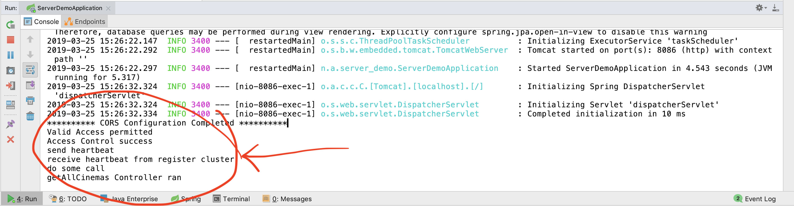

# 电影评分系统——DEMO说明

 

## 小组成员

| 姓名   | 学号      |
| ------ | --------- |
| 陈骁   | 161250014 |
| 吉宇哲 | 161250047 |
| 赖健明 | 161250051 |
| 连远翔 | 161250065 |
| 何天⾏ | 161250039 |
| 胡本霖 | 161250042 |
| 乐盛捷 | 161250053 |
| 雷诚   | 161250054 |

 

 

## 目录

[TOC]

 

 

## 1. 运行平台说明

### 1.1 客户端平台

- macOS 10.14.2, Xcode 10.1
- 使用运行macOS的电脑，在App Store中输入"Xcode"进行查找即可安装Xcode

### 1.2 服务端平台

- Java 1.8.0_171, 下载请移步https://www.java.com
- IntelliJ IDEA, 下载请移步https://www.jetbrains.com/idea/
- MySQL 5.23, 下载请移步https://dev.mysql.com/downloads/mysql/

 

 

## 2. 运行方式

### 2.1 运行客户端

点击选择要运行的iOS设备，之后点击左上角的运行按钮，可以运行在对应的模拟器上

 

### 2.2 运行服务端

在application.properties中修改数据库的配置信息为本机中相应的配置（用户名、密码、数据库名）

 

选择pom.xml，点击 maven -> Reimport导入需要的依赖，之后点击运行按钮进行运行

 

 

## 3. 运行截图

### 3.1 客户端运行截图

 

### 3.2 服务端运行截图

 

 

## 4. 类的说明

在本项目中，我们最终选择的架构为微服务架构，其设计思想主要体现在「ProjectReport」文档中，与之相关的Demo代码结构主要集中在服务器端。

代码中涉及到的package如下所示，分别对应「ProjectReport 6.2 类图」中提到的各个集群和机制

- API网关：对应package为api_gateway
- 注册集群：对应的package为register_cluster
- 服务集群：对应的package为service_cluster
- 数据库集群：对应的package为database_cluster
- 通信机制：对应的package为communication_mechanism
- 外部接口：对应的package为external_interface

