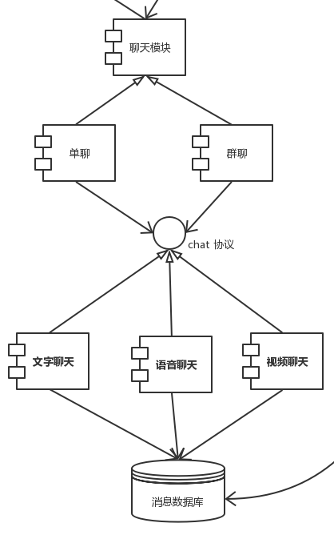
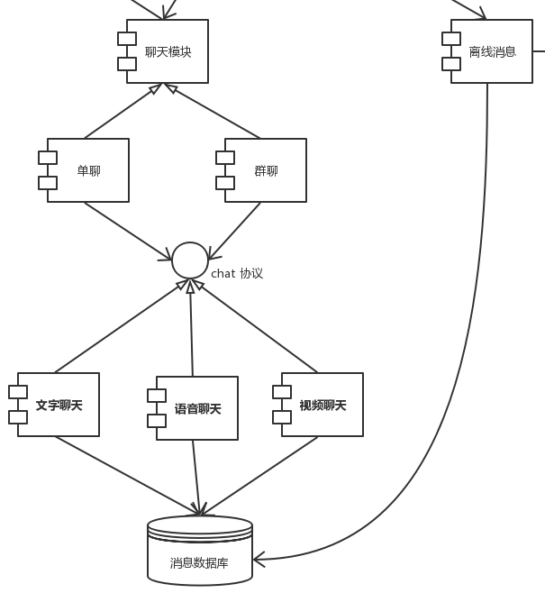

### 场景 A7：点对点消息发送后，对方要在3s内收到消息(H,H)

- 质量属性：性能
- 环境：系统处于正常运行状态
- 刺激：发送一个消息
- 响应：消息发送成功

| 架构决策      | 敏感点 | 权衡点 | 风险决策 | 非风险决策 |
| ------------- | ------ | ------ | -------- | ---------- |
| 使用 UDP 协议 | S1     | T1     |          | N1         |

- 理由：点对点架构不能占用太多节点性能资源。TCP 协议会占用更多的资源和更大的包大小，而 UDP 协议更加灵活，交流的时候成本也更低。
- 相关体系结构图：

### 场景 A8：群聊消息发送后，群聊中每个人要在5s内接收到消息(H,H)

- 质量属性：性能
- 环境：系统出于正常运行状态  
- 刺激：用户在一个群聊中发消息  
- 响应：消息正常发出

| 架构决策                    | 敏感点 | 权衡点 | 风险决策 | 非风险决策 |
| --------------------------- | ------ | ------ | -------- | ---------- |
| 确定事件优先级+限制执行次数 | S2     |        |          | N2         |
| 引入并发机制                | S3     | T2     |          | N3         |

- 理由：实时聊天系统对于性能有较高需求，对时间延迟方面容忍度较低，而且较常遇到大量消息同时发送的场景，因此要对消息传递采用事件优先级+限制执行次数的方式保证性能，同时引入并发机制。
- 相关体系结构图：

### 敏感点列表

| 编号 | 架构决策                    | 理由                                                         |
| ---- | --------------------------- | ------------------------------------------------------------ |
| S1   | 使用 UDP 协议               | TCP 协议会占用更多的资源和更大的包大小，点对点架构不能占用太多节点性能资源，而 UDP 协议更加灵活， 交流的时候成本更低。 |
| S2   | 确定事件优先级+限制执行次数 | 实时聊天系统对于性能有较高需求，较常遇到大量消息同时发送的场景，因此要对消息传递采用事件优先级+限制执行次数的方式保证性能 |
| S3   | 引入并发机制                | 点对点架构中考虑的客户机一般性能不高，程序不应占用过多的内存资源，因此要引入并发机制。 |

### 权衡点列表

| 编号 | 架构决策      | 理由                                                         |
| ---- | ------------- | ------------------------------------------------------------ |
| T1   | 使用 UDP 协议 | 在性能和可靠性之间做出了权衡，UDP 协议由于不持有状态而容易发生信息丢失问题 |
| T2   | 引入并发机制  | 在性能和开发难度之间做出了权衡，并发机制相较于多数据备份的方案更难以理解和开发 |

### 有风险决策列表

| 编号 | 架构决策 | 理由 |
| ---- | -------- | ---- |
|      |          |      |

### 无风险决策列表

| 编号 | 架构决策                    | 理由                                     |
| ---- | --------------------------- | ---------------------------------------- |
| N1   | 使用 UDP 协议               | 基于 UDP 的点对点架构已有成熟的实现方案  |
| N2   | 确定事件优先级+限制执行次数 | 二者都是应对大数据转发量时的常用降级方案 |
| N3   | 引入并发机制                | 并发机制是处理消息时的有效手段，使用广泛 |