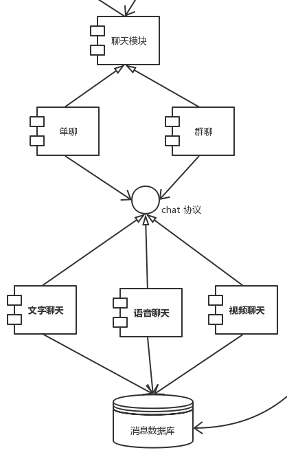
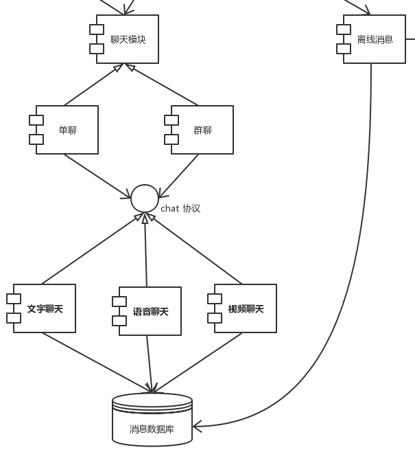

# 评估报告

### 质量属性效应树

| 质量属性              | 具体属性     | 场景                                                         |
| --------------------- | ------------ | ------------------------------------------------------------ |
| 可用性Availability    | 失败恢复     | A1: 对方节点未离线，心跳监控器未收到响应时，要在3s内重连成功(H,M) |
|                       | 失败处理     | A2: 对方节点已经离线，心跳监控器未收到响应，要在3s内切断连接并保存状态(M,M) |
|                       | 消息获取速度 | A3: 节点重新登录后，离线消息要在20s内获得(H,H)               |
|                       | 连接可用     | A4: 群聊中节点离线，其余网络节点仍然可以相互通信(H,H)        |
|                       | 连接可用     | A5: 与内部网络中节点建立连接的成功率为99.99%(H,H)            |
| 安全性Security        | 消息加密     | A6: 消息被截获后，如果对方不能获得私钥，消息被破解率为0%(M,M)     |
| 性能Performance       | 消息延迟     | A7: 点对点消息发送后，对方要在3s内收到消息(H,H)              |
|                       |              | A8: 群聊消息发送后，群聊中每个人要在5s内接收到消息(H,H)      |
| 可修改性Modifiability | 代码修改     | A9: 核心代码修改率为0%(M,M)                                       |
| 可测试性Testability   | 错误发现     | A10: 代码中80%的错误可以在3个小时内找出(M,M)                      |
### 场景

| 场景A1, A2 | 对方节点未离线，心跳监控器未收到响应时，要在3s内重连成功 对方节点已离线，心跳监控器未收到响应时，要在3s内切断连接并保存状态 |
| ---------- | ------------------------------------------------------------ |
| 质量属性   | 可用性                                                       |
| 环境       | 运行时                                                       |
| 刺激       | 没有收到对方节点的响应                                       |
| 响应       | 尝试重新连接（连接成功或作出对方已下线的判断）               |
| 架构决策   | UDP 敏感点：S1 权衡点：T1 有风险决策：R1  Heartbeat 敏感点：S2 权衡点：T2 有风险决策：R2 |
| 理由说明   | 可用性是该系统设计中着重点关注的质量属性，节点之间互相通信从而保持状态的同步是系统可用的前提条件。心跳监控器可能会因为一些不可控的原因未收到响应，这时需要能够及时恢复，优先级很高。为了保障这一点，值得采用高性能成本的措施（Heartbeat）。同时为了控制资源大小，采用更轻便传输协议标准。 |
|架构图||

| 场景A3   | 节点重新登录后，离线消息要在20s内获得                        |
| -------- | ------------------------------------------------------------ |
| 质量属性 | 可用性                                                       |
| 环境     | 运行时                                                       |
| 刺激     | 重新登录                                                     |
| 响应     | 尝试获取离线信息                                             |
| 架构决策 | UDP 敏感点：S1 权衡点：T1 有风险决策：R1  |
| 理由说明 | 在离线状态下，系统仍应该保持可用性。为了能够使用户上线后尽快获取离线消息，选择更轻便的传输协议标准 |
|架构图||

| Scenario A4 | 群聊中节点离线，其余网络节点仍然可以相互通信(H,H)            |
| ----------- | ------------------------------------------------------------ |
| 质量属性    | 可用性                                                       |
| 环境        | 群聊中有节点已离线                                           |
| 刺激        | 群聊中有节点发生异常或者退出群聊                             |
| 响应        | 其他群聊中的节点相应交换状态并建立新的连接                   |
| 架构决策    | 使用Ping / echo发现节点的状态变化  敏感点：S3  权衡点：T3  有风险决策：R3    Restart  敏感点：S4  无风险决策：N1    Exception Handling / Increase Competence Set  敏感点：S5 无风险决策：N2 |
| 理由        | 定位仅仅发生在聊天开始的时候，使用频率较低，虽然heartbeat性能更好，但是没有必要，因此选择Ping/echo。由于系统主要运行在客户端上，使用热备份或冷备份都不现实，因此只能尝试restart来恢复。Exception Handling 是语言内建的错误处理机制，Increase Competence Set 是在需求阶段对更多的异常场景进行考虑和设计，两者都有助于提高系统的健壮性和可用性。 |
| 架构图      |  |

| Scenario A5 | 与内部网络中节点建立连接的成功率为99.99%(H,H)                |
| ----------- | ------------------------------------------------------------ |
| 质量属性    | 可用性                                                       |
| 环境        | 系统正常工作中                                               |
| 刺激        | 对等节点在内网中                                             |
| 响应        | 尝试去连接内部网络中的节点                                   |
| 架构决策    | 反向代理  敏感点：S6  权衡点：T4  无风险决策：N3 |
| 理由        | 系统要允许内网节点和外网节点进行通信。使用反向代理方法，在内网和外网间增加额外的代理节点，可以在较少的开发成本下，实现内网穿透。 |
| 架构图      |  |

| 场景A6   | 消息被截获后，如果对方不能获得私钥，消息被破解率为0%         |
| -------- | ------------------------------------------------------------ |
| 质量属性 | 安全性                                                       |
| 环境     | 运行时                                                       |
| 刺激     | 消息被截获                                                   |
| 响应     | 在不具备私钥的情况下，消息内容不能被破解                     |
| 架构决策 | 密钥加密 敏感点：S7  无风险决策：N4   |
| 理由说明 | 对用户隐私的保护是p2p这样去中心化架构的优势所在，系统需要对用户信息加密，防止不相关人等看到。在网络通信中截获数据包相对容易，这时便需要通过加密保护用户的信息安全。 |
|架构图||

| 场景 A7        | 点对点消息发送后，对方要在3s内收到消息(H,H)                  |
| -------------- | ------------------------------------------------------------ |
| 质量属性       | 性能                                                         |
| 环境           | 系统处于正常运行状态                                         |
| 刺激           | 发送一个消息                                                 |
| 响应           | 消息发送成功                                                 |
| 架构决策       | 使用 UDP 协议 敏感点：S8 权衡点：T5 无风险决策：N5 |
| 理由           | 点对点架构不能占用太多节点性能资源。TCP 协议会占用更多的资源和更大的包大小，而 UDP 协议更加灵活，交流的时候成本也更低。 |
| 相关体系结构图 |                                                 |

| 场景 A8        | 群聊消息发送后，群聊中每个人要在5s内接收到消息(H,H)          |
| -------------- | ------------------------------------------------------------ |
| 质量属性       | 性能                                                         |
| 环境           | 系统处于正常运行状态                                         |
| 刺激           | 用户在一个群聊中发消息                                       |
| 架构决策       | 确定事件优先级并限制执行次数 敏感点：S9 无风险决策：N6  引入并发机制 敏感点：S10 权衡点：T6 无风险决策：N7 |
| 理由           | 实时聊天系统对于性能有较高需求，对时间延迟方面容忍度较低，而且较常遇到大量消息同时发送的场景，因此要对消息传递采用事件优先级+限制执行次数的方式保证性能，同时引入并发机制。 |
| 相关体系结构图 |                                                 |

### 敏感点列表

| 编号 | 架构决策                                     | 理由                                                         |
| ---- | -------------------------------------------- | ------------------------------------------------------------ |
| S1   | UDP                                          | 聊天应用中信息传输是核心，对传输协议的选择是可用性和性能的敏感点。 |
| S2   | Heartbeats                                   | 在p2p环境下，节点之间需要状态的同步，这才能保证系统正常运行，是可用性的敏感点。 |
| S3   | 使用Ping / echo发现节点的状态变化            | 对于性能和可用性是敏感点。Ping/echo提高了可用性，但是会造成节点的性能负担。 |
| S4   | Restart                                      | 对于可用性是敏感点。Restart有助于从错误中恢复，提高客户端可用性。 |
| S5   | Exception Handling / Increase Competence Set | 对于可用性是敏感点。Exception Handling / Increase Competence Set 有助于避免失败，提高系统可用性。 |
| S6   | 反向代理                                     | 对于可用性、性能和安全性是敏感点。反向代理提高了可用性，但是代理节点会成为性能瓶颈，也会成为攻击目标。 |
| S7   | 密钥加密                                     | 有效保护信息安全，是安全性的敏感点。                         |
| S8   | 使用 UDP 协议                                | TCP 协议会占用更多的资源和更大的包大小，点对点架构不能占用太多节点性能资源，而 UDP 协议更加灵活， 交流的时候成本更低。 |
| S9   | 确定事件优先级+限制执行次数                  | 实时聊天系统对于性能有较高需求，较常遇到大量消息同时发送的场景，因此要对消息传递采用事件优先级+限制执行次数的方式保证性能 |
| S10  | 引入并发机制                                 | 点对点架构中考虑的客户机一般性能不高，程序不应占用过多的内存资源，因此要引入并发机制。 |

### 权衡点列表

| 编号 | 架构决策                          | 理由                                                         |
| ---- | --------------------------------- | ------------------------------------------------------------ |
| T1   | UDP                               | UDP协议本身只能提供数据的不可靠传递，但是更灵活，资源成本更低。 |
| T2   | Heartbeats                        | 节点之间以心跳包的方式不断交换信息，给节点带来额外的计算需要，但是可以提高可用性。 |
| T3   | 使用Ping / echo发现节点的状态变化 | 在性能和可用性之间做了权衡。提高了可用性，但降低了性能。     |
| T4   | 反向代理                          | 反向代理服务器提高可用性的同时也会容易成为被攻击的对象，是安全性和可用性的权衡点。 |
| T5   | 使用 UDP 协议                     | 在性能和可靠性之间做出了权衡，UDP 协议由于不持有状态而容易发生信息丢失问题 |
| T6   | 引入并发机制                      | 在性能和开发难度之间做出了权衡，并发机制相较于多数据备份的方案更难以理解和开发 |

### 有风险决策列表

| 编号 | 架构决策                          | 理由                                                         |
| ---- | --------------------------------- | ------------------------------------------------------------ |
| R1   | UDP                               | 可能因为掉包率过高，导致需要手动实现重发等机制，增加编程实现难度，且最终效率并不高。 |
| R2   | Heartbeats                        | 占用过多资源，导致性能低下。                                 |
| R3   | 使用Ping / echo发现节点的状态变化 | 需要发送两次请求，可能会造成网络拥堵，影响通信，降低性能     |

### 无风险决策列表

| 编号 | 架构决策                                     | 理由                                                         |
| ---- | -------------------------------------------- | ------------------------------------------------------------ |
| N1   | Restart                                      | 客户端重启是一种常用的客户端错误恢复手段                     |
| N2   | Exception Handling / Increase Competence Set | Exception Handling 和 Increase Competence Set 是广泛使用的避免失败的手段 |
| N3   | 反向代理                                     | 反向代理是一种广泛使用的内网穿透技术                         |
| N4   | 密钥加密                                     | 这是保护用户数据安全的必要措施                               |
| N5   | 使用 UDP 协议                                | 基于 UDP 的点对点架构已有成熟的实现方案                      |
| N6   | 确定事件优先级+限制执行次数                  | 二者都是应对大数据转发量时的常用降级方案                     |
| N7   | 引入并发机制                                 | 并发机制是处理消息时的有效手段，使用广泛                     |
