# 电影评分系统——项目文档

 

## 小组成员

| 姓名   | 学号      |
| ------ | --------- |
| 陈骁   | 161250014 |
| 吉宇哲 | 161250047 |
| 赖健明 | 161250051 |
| 连远翔 | 161250065 |
| 何天⾏ | 161250039 |
| 胡本霖 | 161250042 |
| 乐盛捷 | 161250053 |
| 雷诚   | 161250054 |

 

 

## 目录

[TOC]

 

 

 

## I.候选架构

### 1.1 分布式微服务架构

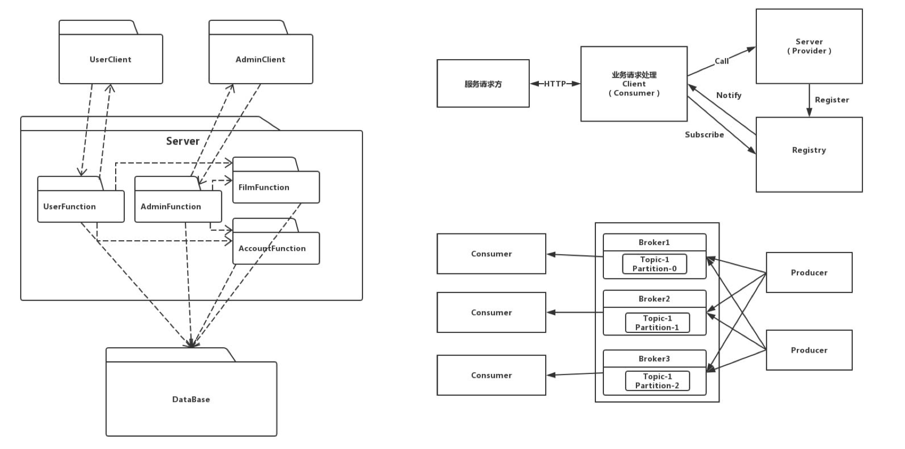

分布式系统具有更⾼的可延展性，当单个硬件的能⼒达到瓶颈时，通过增加数量来提⾼系统整体的性能。采⽤分布式系统可以在架构上对未来的⽤户增⻓长和数据增⻓长作好准备。卖票功能与地理位置关系密切，分布式系统可以根据⽤户所在地理位置，选择较近的结点作出反应，从⽽减少延迟，提升⽤户体验。此外，分布式系统的容错性，当某结点的出现意外，其他结点仍然可以正常运⾏，提⾼系统的可⽤性。

 

 

### 1.2 CS架构

Client-Server架构将系统拆分为服务端和客户端，客户端⽆须关⼼服务端的内部实现，仅通过⽹络调⽤服务器提供接⼝即可，这降低了客户端和服务端之间的耦合，同时隐藏了数据的储存策略，另外服务端和客户端可採⽤两种的硬件设备，对于计算要求较⾼的服务端，则可以採⽤⾼性能的硬件设备，客户端则不需，从⽽降低成本。服务器和客户端之间的职责明确清晰，这使得服务端和客户端可同时开发，降低开发的时间成本。

 

 

 

## II. 项目需求信息

### 2.1 项目的功能需求

- ⽤户购票：⽤户可以在平台上选择影院或电影查看上映，然后对电影进⾏选票的操作
- 发表评论：⽤户可以在观影完成后对电影进⾏评分和评论操作。
- 回复评论：⽤户可以看到其他⽤户的评分和评论，并可以对其他⽤户的评论进⾏评论、或者“顶/踩”操作。
- 账户管理：⽤户可以设置个⼈信息，包括昵称、⼿机号、密码、感兴趣电影类型等信息
- 订单管理：⽤户可以对已经购买的电影订单进⾏查看、退票、改签等操作。
- 报表查看：管理员可以查看每部电影的销售情况或者每个影院每次放映的的上座率，⽤户画像等资料
- 电影管理：管理员可以对电影进⾏上架和下架等操作。
- 排片管理：电影院的管理员可以基于系统的已有电影进行其电影院的排片操作，同时本系统和其他电影院的系统进行同步座位、价格和场次情况

 

 

### 2.2 应用场景

获得样本输入，筛选掉不必要的需求，列出 ASR：

#### 场景 1：\>100的用户同时购买同一场电影的票（可靠性reliability、性能performance；高高）

| 场景组成部分 | 可能的值                                                     |
| ------------ | ------------------------------------------------------------ |
| 源           | 系统用户                                                     |
| 刺激         | \>100的用户同时购买同一场电影的票                            |
| 制品         | 系统的负载均衡模块、业务模块和数据库系统                     |
| 环境         | 系统正常运行                                                 |
| 响应         | 系统帮助用户正常完成购买操作 服务器端的数据库中的数据正常修改 客户端用户界面及时刷新 |
| 响应度量     | 98%以上的用户请求可以正常完成 90%以上的用户请求在1s内完成 |

 

#### 场景 2：用户进行正确操作（易用性usability；高中）

| 场景组成部分 | 可能的值                                                     |
| ------------ | ------------------------------------------------------------ |
| 源           | 系统用户                                                     |
| 刺激         | 用户执行正常操作                                             |
| 制品         | 系统的客户端和服务器端                                       |
| 环境         | 系统正常运行                                                 |
| 响应         | 用户的操作得到期望的反馈 软件的操作简单易学、可以快速掌握 |
| 响应度量     | 90%以上的用户可以在30min内熟练使用本系统 98%以上的用户可以正确使用本系统完成任务 |

 

#### 场景 3：用户进行错误操作（鲁棒性robustness；高高）

| 场景组成部分 | 可能的值                                                     |
| ------------ | ------------------------------------------------------------ |
| 源           | 系统用户                                                     |
| 刺激         | 用户执行错误操作                                             |
| 制品         | 系统的客户端的错误处理模块                                   |
| 环境         | 系统正常运行                                                 |
| 响应         | 用户的操作被拒绝 系统提示错误信息 系统告知用户可能的解决办法 |
| 响应度量     | 系统在2s内确认错误操作，并给用户错误提示信息                 |

 

#### 场景 4：客户端迁移到其他系统或环境（可移植性Portability；低中）

| 场景组成部分 | 可能的值                                                     |
| ------------ | ------------------------------------------------------------ |
| 源           | 开发人员、维护人员                                           |
| 刺激         | 客户端或者服务端迁移到新的环境                               |
| 制品         | 客户端、服务端                                               |
| 环境         | 系统开发环境、或者系统维护和配置时                           |
| 响应         | 系统成功部署到运行环境 系统完成修改并通过所有测试        |
| 响应度量     | 完成部署和移植的代价为1个人月 移植成本占总成本的比例不得高于5% |

 

#### 场景 5：为系统加入新的功能和服务（可扩展性Extensibility、可维护性Maintainability；高高）

| 场景组成部分 | 可能的值                                                     |
| ------------ | ------------------------------------------------------------ |
| 源           | 系统开发人员                                                 |
| 刺激         | 系统需要加入新的功能                                         |
| 制品         | 新添加的业务模块                                             |
| 环境         | 系统运行环境，系统正常运行                                   |
| 响应         | 新的功能成功部署 客户端正常更新                          |
| 响应度量     | 系统的发布不会影响99%以上用户的正常使用 添加系统功能时服务器维护时间在2小时以内 |

 

#### 场景 6：数据库崩溃（可用性avibility、安全性Security；中中）

| 场景组成部分 | 可能的值                                                     |
| ------------ | ------------------------------------------------------------ |
| 源           | 系统开发人员、系统维护人员                                   |
| 刺激         | 数据库无法提供正常服务                                       |
| 制品         | 数据库系统、错误处理模块                                     |
| 环境         | 系统运行环境，系统正常运行；或者系统整体测试时               |
| 响应         | 尽快恢复数据库的正常功能 根据日志等记录信息定位崩溃原因  |
| 响应度量     | 在1h内使数据库恢复到可以正常工作的状态 在3个人日内查明并修复造成崩溃的原因 |

 

#### 场景 7：增加新的硬件设施（可伸缩性scability；低低）

| 场景组成部分 | 可能的值                                           |
| ------------ | -------------------------------------------------- |
| 源           | 系统开发人员、系统维护人员                         |
| 刺激         | 服务器端需要增加新的硬件设施                       |
| 制品         | 机房硬件                                           |
| 环境         | 系统运行环境，系统正常运行                         |
| 响应         | 系统的正常运行和功能不受影响                       |
| 响应度量     | 在2h内完成系统的维护 98%的用户访问不会受到影响 |

 

#### 场景 8：修改系统已有的功能（可修改性Modifibility；高中）

| 场景组成部分 | 可能的值                                                 |
| ------------ | -------------------------------------------------------- |
| 源           | 系统开发人员                                             |
| 刺激         | 服务器端的代码需要重新部署                               |
| 制品         | 服务器端业务模块                                         |
| 环境         | 系统运行环境，系统正常运行                               |
| 响应         | 系统的正常运行和功能不受影响                             |
| 响应度量     | 在2h内完成功能的修改和部署 98%的用户访问不会受到影响 |

 

#### 场景 9：系统服务器无法正常运行（可用性availability；高中）

| 场景组成部分 | 可能的值                                                     |
| ------------ | ------------------------------------------------------------ |
| 源           | 系统服务器                                                   |
| 刺激         | 系统服务器崩溃，无法提供服务                                 |
| 制品         | 服务器端业务模块                                             |
| 环境         | 系统服务器出现故障，无法正常运行                             |
| 响应         | 查明服务器故障原因，修复系统故障 记录并保存故障日志 通知访问的用户相应的功能暂时无法使用 解决问题并重启服务器 |
| 响应度量     | 在3h内查明并修复故障 保证服务器在99%以上的运行时间内正常工作 |

 

#### 场景 10：未登录的用户进行购票操作（安全性security；高中）

| 场景组成部分 | 可能的值                                                     |
| ------------ | ------------------------------------------------------------ |
| 源           | 未经授权的个人或者其他系统用户                               |
| 刺激         | 进行购票和支付操作                                           |
| 制品         | 系统的用户管理模块                                           |
| 环境         | 系统正常运行，但是用户没有登录                               |
| 响应         | 系统拒绝用户进行相应操作，并提示用户进行登录                 |
| 响应度量     | 在2s内拒绝未登录的用户进行操作 在拒绝请求之后记录相应的日志 |

 

#### 场景 11：系统出现功能缺陷（可测试性testability；中中）

| 场景组成部分 | 可能的值                                                     |
| ------------ | ------------------------------------------------------------ |
| 源           | 开发者                                                       |
| 刺激         | 开发者发现系统存在BUG                                        |
| 制品         | 修复BUG的系统                                                |
| 环境         | 系统开发过程中，或者系统正常运行，                           |
| 响应         | 通过测试定位出现BUG的代码块 修改系统BUG，并测试修改后的代码 部署新的代码并重新启动系统 |
| 响应度量     | 在1h内定位出现BUG的代码块 在6h内修复系统BUG并通过测试 在2h内完成新代码的部署工作 |

 

#### 场景 12：用户网络不稳定或失去连接（可用性availability；中高）

| 场景组成部分 | 可能的值                                                     |
| ------------ | ------------------------------------------------------------ |
| 源           | 用户所处的网络环境                                           |
| 刺激         | 网络不稳定或失去连接                                         |
| 制品         | 用户进行的操作                                               |
| 环境         | 客户端软件在无网络或网络不稳定的环境下运行                   |
| 响应         | 保存用户的操作和相应的信息 及时告知用户网络存在问题 等到网络状况良好时重新进行操作 |
| 响应度量     | 用户的操作和信息在0.5s内保存 在1s内告知用户相应的问题 检测到网络连接状况良好时，在1s内重新进行操作 |

 

 

 

## III. 对分布式微服务架构应用ADD

### 3.1 迭代一

#### 3.1.1 需求信息

参见「II. 项目需求信息」

 

#### 3.1.2 分解的系统组件

本次迭代进行整体架构设计，没有要分解的组件

 

#### 3.1.3 架构视图

 

 

### 3.2 迭代二

#### 3.2.1 需求信息

参见「II. 项目需求信息」

 

#### 3.2.2 分解的系统组件

选择服务集群进行分析、设计和分解，该组件负责提供具体的服务，同时要兼具性能、高可用性、高安全性，同时要和注册集群、数据库集群等集群建立联系。该组件决定了系统的稳定性、可用性和性能。作为系统的重中之重，在第二次迭代进行分解。

 

#### 3.2.3 组件负责的ASR

| 架构驱动                                | 重要性 | 难易度 |
| --------------------------------------- | ------ | ------ |
| 场景1：\>100的用户同时购买同一场电影的票 | 高     | 高     |
| 场景7：增加新的硬件设施                 | 低     | 低     |
| 场景9：系统服务器无法正常运行           | 高     | 中     |
| 场景10：未登录的用户进行购票操作         | 高     | 中     |

 

#### 3.2.4 为ASR进行设计

1. **设计关注点**

| 质量属性 | 设计关注点 | 子关注点 |
| ------ | --------- | ------ |
| 性能 | 业务处理能力 | 数据读取 数据计算 |
| 可用性 | 服务器宕机处理 | 服务器备份 服务器状态监控 服务器恢复 |
| 安全性 | 用户认证 | 授权识别 权限拒绝处理 限制接入数量 |

2. **关注点的候选模式**

   - **数据读取**

     | # | 候选模式名称 | 性能 | 资源消耗 |成本| 并发读取能力 |
     | --|--------- | ------ | ------ |  -- |--|
     | 1 | 提高数据库读取性能 | 高 | 高 | 高 | 中|
     | 2 | 增加数据检索服务节点 | 高 | 高 | 中 |中|

     - **选择的模式及理由**
       
       选择增加数据检索服务节点。数据库性能的提升是有瓶颈的，提升单个数据库的性能需要大量资源，提升开发成本，然而增加数据检索服务节点更加灵活，在成本方面也略少。（在前期可以考虑提高数据库读取性能，因为电影类所需计算并不多）

   - **数据计算**

      | # | 候选模式名称 | 性能 | 可伸缩性 |单个计算速度| 大量计算速度 |
      | --|--------- | ------ | ------ |  -- |--|
      | 1 | 增加数据计算服务节点 | 中 | 高 | 中 |中|
      | 2 | 提高单机计算性能 | 高 | 低 | 中 |低|

      - **选择的模式及理由**

        增加数据计算服务节点。因为如果要使用提高单机计算节点的性能的方式，其可伸缩性是很低的，增加性能需要重新部署和启动整个系统，并且由于很高性能的计算节点价格昂贵，所以提高单机计算节点性能所花费的金钱成本是很高的且收效甚微。而使用增加数据计算服务节点的方式，可伸缩性强，不需要重新部署和启动整个系统，在提高性能的过程中服务依然是可用的，且相对成本较低，所以由于提高单机计算性能。

   - **服务器备份**

     | # | 候选模式名称 | 性能 | 开销 | 是否可能产生服务丢失 |
     | --|--------- | ------ | ------ |  -- |
     | 1 | 对数据进行完全备份 | 低 | 高 | 否 |
     | 2 | 双机热备份 | 中 | 高 | 否 |
     | 3 | 双机互备份 | 中 | 中 | 一般不会 |
     | 4 | 双机双工 | 高 | 中 | 一般不会 |

     - **选择的模式及理由**

       选择使用双机双工模式，因为如果每天对数据进行完全备份会消耗大量的硬件和存储资源，同时需要专门的时间进行备份，性能较低；而双机热备份和双机互备份同时只运行一台机器，有一定的硬件性能的浪费，同时双机互备份要求在一台机器在另一台机器出现问题时立刻接管故障服务器的应用，对服务器的性能要求较高；而双机双工模式中，两台服务器均为活动，同时运行相同的应用，实现了负载均衡，且不易产生服务丢失，效果较好，从而选择使用双机双工模式。

   - **服务器状态监控**
   
     | # | 候选模式名称 | 时延 | 资源消耗 | 监控程度 |
     | --|--------- | ------ | ------ | -- |
     | 1 | Heartbeat模式 | 低 | 中 | 高 |
     | 2 | Ping/Echo | 中 | 低 | 中 |

     - **选择的模式及理由**

       选择Ping/Echo模式，因为在分布式环境下，服务节点一般会很多，所以根据概率而言，宕机少部分服务器对用户和整个系统的服务而言一般影响不大；其次监控中心需要对大量的服务器进行监控，所以资源消耗对监控模块而言至关重要，所以选择资源消耗较低的Ping/Echo模式对服务器进行监控。

   - **服务器恢复**

     | # | 候选模式名称 | 成功率 | 不可用时间 | 故障排查率 |
     | --|--------- | ------ | ------ | -- |
     | 1 | 记录错误信息，服务自启动 | 低 | 短 | 低 |
     | 2 | 设置checkpoint，等待手动启动 | 高 | 长 | 高 |

     - **选择的模式及理由**

       在分布式的环境下，一台或少数服务器的宕机不会影响整个系统的工作，但是对服务器状况和错误的了解及修正是十分重要的，这可以让我们了解系统的工作状况和发生错误的上下文条件，所以选择设置checkpoint，等待手动启动。

   - **用户认证**

      | # |   候选模式名称   | 性能 | 安全性 | 实现难度 |
      | - | --------------- | --- | ------ | ------- |
      | 1 | 基于cookie的认证 | 中 | 高 | 高 |
      | 2 | 基于token的认证  | 高 | 高 | 低 |

      - **选择的模式及理由**

        选择使用基于token的认证。因为如果使用cookie，则服务器端要为每个用户保留会话信息，当连接的用户增多时，服务器将需要更多的内存。同时，token自己存储需要的所有信息，每次认证的时候服务器不必进行数据库查询，提高执行效率。
      
   - **限制接入**

      | # | 候选模式名称 | 性能 | 安全性 | 实现难度 |
      | - | --------- | ------ | ------ |-- |
      | 1 | 限制总连接数 | 中 | 中 | 低 |
      | 2 | 限制接口每秒的请求数 | 中 | 中 | 低 |

     - **选择的模式及理由**
     
        选择限制接口每秒的请求数。虽然这两种方法在性能、安全性和实现难度上基本没有什么差别，但限制总连接数缺乏平滑处理，因此选择限制接口每秒的请求数。

   - **访问权限控制**

      | # | 候选模式名称 | 性能 | 安全性 | 实现难度 |
      | - | ----------- | ---- | ----- | ------- |
      | 1 | 使用访问控制矩阵 | 低 | 中 | 低 |
      | 2 | 使用访问控制表   | 中 | 高 | 中 |
      | 3 | 使用访问能力表   | 高 | 高 | 中 |

     - **选择的模式及理由**
       
       选择使用访问能力表。因为虽然访问控制矩阵实现简单，便于集中控制，但当用户数量增大时，该方法执行效率低且严重浪费存储空间。同时，由于访问控制表的权限传递困难，因此不适合用在用户数量大、动态性高的分布式系统中。   

3. **候选模式与对应ASR**
  
| 模式类型             | 选择的模式            | 架构驱动     |
| -------------------- | ------------------- | ------------ |
| 数据读取   | 增加数据检索服务节点 | 场景1、场景7 |
| 数据计算   | 增加数据检索服务节点              | 场景1、场景7   |
| 服务器备份 | 双机双工              | 场景9 |
| 服务器状态监控 | Ping/Echo     | 场景9 |
| 服务器恢复   | 设置checkpoint，等待手动启动    | 场景9 |
| 用户认证     | 基于token的认证 | 场景10 |
| 限制接入    | 限制接口每秒的请求数 | 场景10 |
| 访问权限控制 | 使用访问能力表  | 场景10 |

 

#### 3.2.5 架构视图

1. **C&C视图**

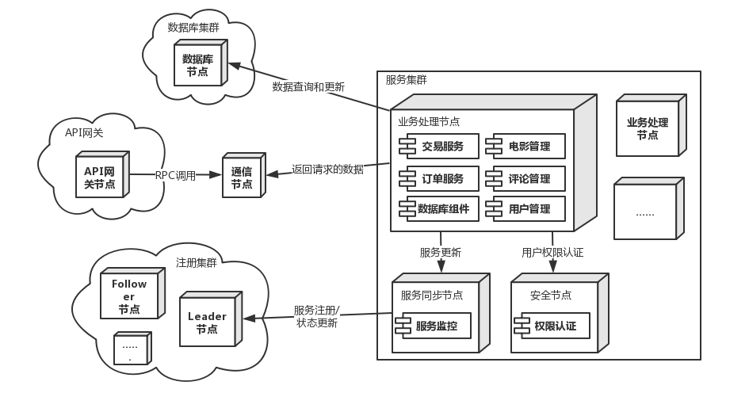

2. **Module视图**

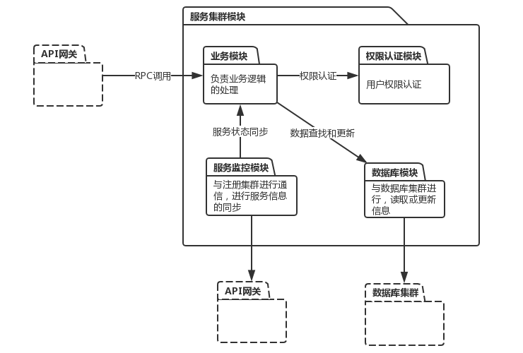

 

#### 3.2.6 评估

本次设计使用ADD方法对服务集群模块进行分解、细化，在考虑各质量属性的同时，兼顾了系统的实际成本（数据库存储），并在系统性能、可用性及安全性之间做了权衡，较好的兼顾了上述各质量属性。

 

 

### 3.3 迭代三

#### 3.3.1 需求信息

参见「II. 项目需求信息」

 

#### 3.3.2 分解的系统组件

选择注册集群进行分析、设计和分解，该组件负责服务集群中服务的分发，是保证系统负载均衡以及服务稳定、可靠、性能良好的关键，此组件在系统中起到至关重要的作用。

 

#### 3.3.3 组件负责的ASR

| 架构驱动                                | 重要性 | 难易度 |
| --------------------------------------- | ------ | ------ |
| 场景1：\>100的用户同时购买同一场电影的票 | 高     | 高     |
| 场景2：用户进行正确操作                 | 高     | 中     |
| 场景5：为系统加入新的功能和服务         | 高     | 高     |
| 场景8：修改系统已有的功能               | 高     | 中     |
| 场景9：系统服务器无法正常运行           | 高     | 中     |

 

#### 3.3.4 为ASR进行设计

1. **设计关注点**

| 质量属性 | 设计关注点 | 子关注点 |
| ------ | --------- | ------ |
| 性能、可用性 | 服务分发能力 | 服务分发的负载均衡 |
| 可靠性 | 服务更新能力 | 注册节点的同步能力 |
| 易用性、可维护性 | 服务节点的架构 | 服务节点的通信 |
| 可扩展性、可修改性 | 修改服务节点对系统的影响 | 服务注册表的构建能力 服务节点的部署能力 |

2. **关注点的候选模式**

   - **服务分发的负载均衡**

     | # | 候选模式名称 | 处理性能 | 资源开销 | 开发成本 |
     | --|--------- | ------ | ------ | --|
     | 1 | 使用F5或Array硬件处理请求分发 | 高 | 高 | 低 |
     | 2 | 使用Ngnix等软件处理请求分发 | 中 | 低 | 低 |
     | 3 | 在客户端存储和维护服务端清单 | 中 | 低 | 中 |

     - **选择的模式及理由**

       使用硬件处理分发请求虽然效率更高，但与快速迭代和部署的现实要求有所冲突；使用Ngnix等软件处理请求分发，可以进行快速的迭代和修改，同时可以很方便地修改配置，同时在正常流量下可以保证与硬件分发相差不大的性能提升。

       但是无论哪种方法，都会在数据量集中访问的情况下出现单点的性能瓶颈问题，可以通过在客户端存储和维护服务端清单来减少客户端对负载均衡节点的访问，提升效率。

       最后选择的模式为“使用Ngnix等软件处理请求分发”和“在客户端存储和维护服务端清单”。

   - **注册节点的同步能力**

     | # | 候选模式名称 | CAP | 服务健康检查 |
     | --|--------- | ------ | ------ |
     | 1 | Server/Client模式 | AP | 可配支持 |
     | 2 | Gossip协议 | CP | 支持 |
     | 3 | Zab协议栈模式 | CP | 支持 |

     - **选择的模式及理由**

       CAP原则，指的是在一个分布式系统中，Consistency(一致性，各数据备份处于同一状态)、Availability(可用性，系统中的一部分节点宕机后，系统能相应用户请求)、Partition Tolerance(分区容错性，系统能容忍网络区间通信出现失败)，不能同时成立。

       Server/Client模式为了保证高可用，在一致性方面做了妥协；而Gossip协议虽然达到了高可靠却不能保证高可用性。Zab协议栈模式在两者之前做课相应的妥协。鉴于本系统对于一致性和可用性都没有特别高的性能追求，最终选择Zab协议栈模式。

   - **服务节点的通信**

     | # | 候选模式名称 | 复杂度 | 成本 |
     | --|--------- | ------ | ------ |
     | 1 | Restful API | 低 | 低 |
     | 2 | 消息队列 | 中 | 低 |

     - **选择的模式及理由**

       注册集群内的组件，每个服务运行在其独立的进程中，服务和服务之间采用轻量级的通新机制进行互相沟通。

       使用基于HTTP的Restful API，相较于消息队列机制，能够更方便地提供复杂数据结构的编码和传输，同时因为注册集群需要和其他各个集群进行较为频繁的交流，使用HTTP协议可以保证数据传送完成后关闭协议，网络资源的释放和管理更加灵活方便。因此选用Restful API。

   - **服务注册表的构建能力**

     | # | 候选模式名称 | 速度 | 成本 | 可靠性 |
     | --|--------- | ------ | ------ | --|
     | 1    | 业务服务器更新时更新注册中心   | 快   | 高   | 低     |
     | 2    | 注册中心定时检查业务服务器状态 | 慢   | 中   | 中     |
     | 3    | 业务服务器定时更新注册表       | 快   | 高   | 高     |

     - **选择的模式及理由**

       通过只在业务服务器更新时更新注册中心，可以有效减少网络请求的次数，但是在业务服务器宕机等意外情况下，注册中心并不能及时获取业务服务器的状态。

       在注册中心和业务服务器定时发送信息的情况下，考虑到快速迭代的需求，需要使得新加入的服务器能够第一时间进行业务协作。考虑到这一点，可以选择模式3，有业务服务器实现注册中心的接口，定时更新注册表，同时由于注册中心不必发出多个网络请求，降低了负载，减少注册中心宕机的可能性。

   - **服务节点的部署能力**

     | # | 候选模式名称 | 速度 | 成本 | 可用性 |
     | --|--------- | ------ | ------ | --|
     | 1 | 修改注册中心并重新部署 | 慢 | 高 | 低 |
     | 2 | Zab协议栈模式 | 快 | 低 | 中 |

     - **选择的模式及理由**

       修改注册中心并重新部署，系统的维护时间较长，在一些需要快速迭代的场合可能会导致业务上的停摆，同时重新部署可能带来的运行时故障也需要被考虑。

       Zab协议栈基于Paxos算法，它使用了单一的Leader来接受和处理客户端的所有事务请求，并将服务器数据的状态变更以事务Proposal的形式广播到所有的Server中。Zab协议利用崩溃恢复和消息广播两种基本模式提供了相当水平的可用性，新出册的节点在加入后等待，带到下一轮Leader选举时自动进入Follower群组。所以选择Zab协议栈。

3. **候选模式与对应ASR**

| 模式类型             | 选择的模式            | 架构驱动     |
| -------------------- | ------------------- | ------------ |
| 服务分发的负载均衡   | 使用Ngnix等软件处理请求分发 在客户端存储和维护服务端清单 | 场景1、场景9 |
| 注册节点的同步能力   | Zab协议栈模式              | 场景1        |
| 服务节点的通信       | Restful API               | 场景2、场景5 |
| 服务注册表的构建能力 | 业务服务器定时更新注册表     | 场景5、场景8 |
| 服务节点的部署能力   | Zab协议栈模式               | 场景5、场景8 |

 

#### 3.3.5 架构视图

1. **C&C视图**

2. **Module视图**

 

#### 3.3.6 评估

本次设计使用ADD方法对服务注册集群模块进行分解、细化，在考虑各质量属性的同时，兼顾了系统的实际成本，并在系统性能、可靠性、可用性、易用性、可维护性、可扩展性及可修改性之间做了权衡，较好的兼顾了上述各质量属性。

 

 

### 3.4 迭代四

#### 3.4.1 需求信息

参见「II. 项目需求信息」

 

#### 3.4.2 分解的系统组件

选择通信机制模块进行分解，该组件负责API网关、服务集群和注册集群之间网络的传输，需要保证快速、稳定以及高并发的请求和获取服务。

 

#### 3.4.3 组件负责的ASR

| 架构驱动                                 | 重要性 | 难易度 |
| ---------------------------------------- | ------ | ------ |
| 场景1：\>100的用户同时购买同一场电影的票 | 高     | 高     |
| 场景10：未登录的用户进行购票操作         | 高     | 中     |
| 场景12：用户网络不稳定或失去连接         | 中     | 高     |

 

#### 3.4.4 为ASR进行设计

1. **设计关注点**

| 质量属性 | 设计关注点     | 子关注点       |
| -------- | -------------- | -------------- |
| 性能     | 控制资源请求   | 设置任务优先级 |
| 可用性   | 检测连接状态   | 检测通信有效性 |
| 可靠性   | 保证数据完整性 | 数据校验       |
| 安全性   | 网络传输安全   | 信息加密       |

2. **关注点的候选模式**

   - **设置任务优先级**

   | #    | 模式名称             | 性能 | 实时性 | 是否数据丢失 |
   | ---- | -------------------- | ---- | ------ | ------------ |
   | 1    | 使用优先队列处理请求 | 中   | 中     | 否           |
   | 2    | 使用队列处理请求     | 高   | 低     | 否           |
   | 3    | 忽略低优先级请求     | 高   | 高     | 是           |

   - **选择的模式及理由**

     选择使用优先队列来处理信息，这样可以在保证数据不会丢失的情况下仍然可以先处理高优先级的请求。虽然使用队列不会有进行排序的开销，但这样就难以对信息进行控制，不能确保最紧急的请求最优先被处理。同时，虽然忽略低优先级请求具有高效的性能，但其存在数据丢失。因此，优先队列是合理的选择。

   - **检测通信有效性**

     | #    | 模式名称  | 网络负担 | 实现难度 |
     | ---- | --------- | -------- | -------- |
     | 1    | 心跳检测  | 中       | 中       |
     | 2    | Ping/Echo | 高       | 高       |

     - **选择的模式及理由**

       选择使用心跳检测。因为实现心跳检测比实现Ping/Echo要高。同时，完成一次心跳检测只需要发送一次信息，而完成一次Ping/Echo需要发送两次信息，如果使用Ping/Echo则会加大对通信负担。

   - **数据校验**

     | #    | 模式名称     | 正确率 | 实现难度 |
     | ---- | ------------ | ------ | -------- |
     | 1    | 奇偶校验     | 中     | 低       |
     | 2    | 循环冗余校验 | 高     | 高       |

     - **选择的模式及理由**

       选择使用奇偶校验。循环冗余校验之所以能带来高准确率是因为它有更多的校验位，这会增加链路负担，而且对网络传输的数据也只需要进行基本的校验，循环冗余校验的高准确率超过了系统的需要。因此在能满足数据可靠性的情况下，成本较低的奇偶校验是更优的选择。

   - **信息加密**

     | #    | 模式名称            | 性能 | 安全性 | 实现难度 |
     | ---- | ------------------- | ---- | ------ | -------- |
     | 1    | 使用SSL/TLS进行加密 | 高   | 高     | 低       |
     | 2    | 使用AES认证机制     | 中   | 高     | 高       |

     - **选择的模式及理由**

       选择使用SSL/TLS进行加密。因为SSL/TLS被广泛用于数据加密中。不仅如此，SSL/TLS被大多数设备所支持，并且实现该机制的成本更低。

4. **候选模式与对应ASR**

| 模式类型       | 选择的模式           | 架构驱动 |
| -------------- | -------------------- | -------- |
| 设置任务优先级 | 使用优先队列处理请求 | 场景1    |
| 检测通信有效性 | 心跳检测             | 场景12   |
| 数据校验       | 奇偶校验             | 场景1    |
| 信息加密       | 使用SSL/TSL进行加密  | 场景10   |

 

#### 3.4.5 架构视图

1. **C&C视图**

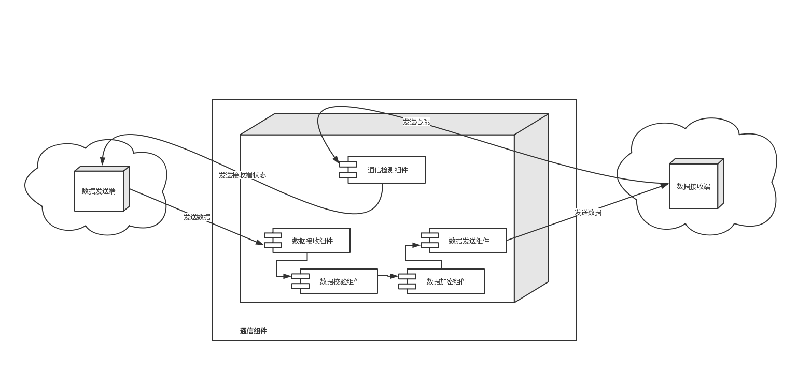

2. **Module视图**

 

#### 3.4.6 评估

本次设计使用ADD方法对通信机制模块进行分解、细化，在考虑各质量属性的同时，兼顾了系统的实际成本，并在系统性能、安全性、可用性及可靠性之间做了权衡，较好的兼顾了上述各质量属性。

 

 

### 3.5 迭代五

#### 3.5.1 需求信息

参见「II. 项目需求信息」

 

#### 3.5.2 分解的系统组件

在这轮迭代中选择API网关组件进行分解。API网关接受来自用户浏览器的HTTP请求，然后通过远程过程调用(RPC Remote Procedure Calls)将请求转发到服务集群中，对于整个系统而言API网关组件至关重要。

 

#### 3.5.3 组件负责的ASRs

| 架构驱动                                | 重要性   | 难易度   |
| --------------------------------------- | -------- | -------- |
| 场景1：\>100的用户同时购买同一场电影的票 | 高 | 高 |
| 场景2：用户进行正常操作       | 高 | 中 |
| 场景3：用户进行错误操作       | 高 | 高 |
| 场景9：系统服务器无法正常运行  | 高 | 中 |
| 场景10：未登录的用户进行购票操作 | 高 | 中 |
| 场景12：用户网络不稳定或失去连接 | 中 | 高 |

 

#### 3.5.4 为ASR进行设计

1. **设计关注点**

| 质量属性 | 设计关注点 | 子关注点 |
| ------ | --------- | ------ |
|  可用性(Availability) | 故障恢复机制 | 对不可用服务的发现 对不可用服务的解决 |
|  可用性(Availability) | 对服务的发现和监控 | 保持和服务注册模块的连通 |
|  性能(Performance) | 服务的负载均衡 | 负载均衡模式 |
|  性能(Performance) | 缓存 | 缓存机制 |
|  安全性(Security)  | 有效抵御攻击 | 设置访问权限 身份认证 访问控制 |

2. **关注点的候选模式**

   - **对不可用服务的发现**

     | 模式编号 | 模式 | 可用性 | 响应时间 |
     | --- | ------ | --------- | ------ |
     | 1 | 如果一定量的请求都失败了，说明服务是不可用的 | H | M |
     | 2 | 如果在一定时间内没有成功的请求，说明服务是不可用的 | H | L |
     | 3 | 定时发送Ping请求，如果没有得到Echo，说明服务是不可用的 | H | H |

     - **选择的模式及理由**
     
       选择第一种模式，因为现实生活中不能预测服务到来的频率，如果采用第二种模式，可能会造成服务可用性的误判，而使用第三种方法会造成系统额外的开销，会对性能有一定的影响。

   - **对不可用服务的解决**
   
     | 模式编号 | 模式 | 可用性 | 响应时间 |
     | --- | ------ | --------- | ------ |
     | 1 | 直接返回已经在缓存的结果或者返回错误消息 | H | L |
     | 2 | 直到服务可用前不停尝试重新请求 | L | H |
     | 3 | 在尝试一定次数没有效果时返回缓存的结果或者返回错误信息 | H | M |

     - **选择的模式及理由**
   
       选择第三种模式；第三种模式有较高的可用性且响应时间适中，如果采用第一种模式虽然响应时间比较短，但是对于短暂的不可用服务容易直接返回错误信息降低用户的使用满意度；第二种模式对于长时间的不可用服务容易造成用户等待很久的问题，会提高用户的等待时间。

   - **保持和服务注册模块的连通**
   
     | 模式编号 | 模式 | 可用性 | 花费和成本 |
     | --- | ------ | --------- | ------ |
     | 1 | 使用heartbeat方式和服务注册模块保持联系 | H | H |
     | 2 | 在请求到来的时候对服务注册模块进行Ping操作 | M | M |

     - **选择的模式及理由**
   
       选择第一种模式，因为第一种模式能够保证较高的可用性，虽然花费比较高，但是由于保持和服务注册模块的连通是对系统至关重要的，所以值得花费成本来保障；而第二种方法有可能降低响应用户请求的效率。

   - **负载均衡模式**
   
     | 模式编号 | 模式 | 可用性 | 花费和成本 |
     | --- | ------ | --------- | ------ |
     | 1 | 加权循环调度算法 | M | M |
     | 2 | 最小连接数算法 | H | M |
     | 3 | 源地址哈希算法 | M | L |
     | 4 | 随机算法 | L | L |

     - **选择的模式及理由**
   
       选择第二种模式，最小连接数算法是以后端服务器的视角来观察系统的负载，比较灵活和智能，算法效果较好，极大的提高后端服务器的利用效率，将负载合理地分流到每一台机器。

   - **缓存机制**
   
     | 模式编号 | 模式 | 可用性 | 性能 | 花费和成本 |
     | --- | ------ | ---- | ----- | ------ |
     | 1 | 主动刷新缓存 | H | H | M |
     | 2 | 被动刷新缓存 | H | M | H |

     - **选择的模式及理由**
   
       选择主动刷新的缓存，在获得客户端的请求时，先去缓存表中查找，如果找到了服务地址，进行可用性检查后返回给客户机，如果没有找到，则再向客户机中寻找，找到后更新维护缓存表，而如果使用被动刷新缓存，则服务地址发生改变后就要通知更新缓存，通信时间较长从而影响性能。

   - **设置访问权限，身份认证，访问控制**
   
     | 模式编号 | 模式 | 可用性 | 花费和成本 |
     | --- | ------ | ---- | ----- |
     | 1 | 记录已有的攻击并通过和已有攻击进行比较鉴别出新的攻击 | H | H |
     | 2 | 对能供访问并修改系统数据的人员进行授权和鉴定 | H | M |
     | 3 | 当收到攻击时，要收回对敏感资源的访问权限 | H | M |

     - **选择的模式及理由**
   
       采用第二种和第三种模式的组合，对访问系统数据的人员进行身份认证能够极大的保护系统的安全性同时不会花费太多成本，而在受到攻击时，要能够迅速的对敏感资源进行保护，收回访问权限，从而保护系统的安全性。

3. **候选模式与对应ASR**

| 模式类型     | 选择的模式         | 架构驱动      |
| ------------ | ------------------ | ------------- |
| 对不可用服务的发现 | 如果一定量的请求都失败了，说明服务是不可用的 | 场景1、场景9 |
| 对不可用服务的解决 | 在尝试一定次数没有效果时返回缓存的结果或者返回错误信息 | 场景1、场景9 |
| 保持和服务注册模块的连通 | 使用heartbeat方式和服务注册模块保持联系 | 场景2、场景9 |
| 负载均衡模式 | 最小连接数算法 | 场景1 |
| 缓存机制 | 主动刷新缓存 | 场景1、场景2 |
| 设置访问权限，身份认证，访问控制 | 对能供访问并修改系统数据的人员进行授权和鉴定&&当收到攻击时，要收回对敏感资源的访问权限 | 场景3、场景10、场景12 |

 

#### 3.5.5 架构视图

1. **C&C视图**

2. **Module视图**

 

#### 3.5.6 评估

本次设计使用ADD方法对API网关模块进行分解、细化，在考虑各质量属性的同时，兼顾了系统的实际成本，并在系统性能、安全性及可用性之间做了权衡，较好的兼顾了上述各质量属性。

 

 

### 3.6 迭代六

#### 3.6.1 需求信息

参见「II. 项目需求信息」

 

#### 3.6.2 分解的系统组件

选择系统的数据存储模块进行分解，数据存储模块主要承担职责如下：

- 存储用户信息、电影信息、评论信息、订单信息、交易数据等
- 存储电影海报、用户头像、电影PV等静态资源
- 对外提供统一访问接口
- 内部监控各存储单元（主机）的工作情况

 

#### 3.6.3 组件负责的ASRs

| 架构驱动                                | 重要性 | 难易度 |
| --------------------------------------- | ------ | ------ |
| 场景1：>100的用户同时购买同一场电影的票 | 高     | 高     |
| 场景6：数据库崩溃                       | 高     | 高     |

 

#### 3.6.4 为ASR进行设计

1. **设计关注点**

静态资源：电影海报、用户头像、电影PV
存储单元：存储数据的主机

| 质量属性 | 设计关注点   | 子关注点                           |
| -------- | ------------ | ---------------------------------- |
| 可靠性   | 数据备份     | 数据库备份 文件系统备份        |
| 性能     | 静态资源存储 | 图片存储 文字存储 视频存储 |
| 可移植性 | 对外接口实现 | 数据库操作                         |
| 可用性   | 错误处理     | 数据库宕机                         |

2. **关注点的候选模式**

   - **数据库备份**

     | #    | 模式名称         | 时间开销 | 资源开销 | 成功概率 |
     | ---- | ---------------- | -------- | -------- | -------- |
     | 1    | 实时备份         | 高       | 高       | 高       |
     | 2    | 固定时间间隔备份 | 中       | 中       | 中       |

     - **选择的模式及理由**

       选择实时备份。为了保证系统的可靠性，需要对数据库中的业务数据进行备份，以防数据库崩溃造成无法挽回的损失。由于业务数据直接关系到用户的财产安全，所以选择实时备份模式，虽然相对会消耗更多资源，但是用户的安全始终是第一位的。

   - **文件系统备份**

     | #    | 模式名称         | 时间开销 | 资源开销 | 成功概率 |
     | ---- | ---------------- | -------- | -------- | -------- |
     | 1    | 实时备份         | 高       | 高       | 高       |
     | 2    | 固定时间间隔备份 | 中       | 中       | 中       |

     - **选择的模式及理由**

       选择固定时间间隔备份。相对业务数据而言，访问静态资源所需的系统开销更大，但重要性较低。若采用实时备份，将会造成大量的不必要的系统开销。另一方面，即使文件系统崩溃，大多数情况下也可以通过磁盘恢复得到原有数据。

   - **图片存储**

     | #    | 模式名称       | 时间开销 | 资源开销 | 成本 |
     | ---- | -------------- | -------- | -------- | ---- |
     | 1    | 文件系统存储   | 中       | 低       | 低   |
     | 2    | 图形数据库存储 | 低       | 中       | 高   |

     - **选择的模式及理由**

       选择文件系统存储。相较于极其稳定和成熟的文件系统存储技术，图形数据库技术尚不成熟，无法保证高可用和稳定性。系统需要存储大量电影图片海报等，所以采用文件系统数据库能够存储更多图片。

   - **大段文本存储**

     | #    | 模式名称     | 时间开销 | 资源开销 | 成本 |
     | ---- | ------------ | -------- | -------- | ---- |
     | 1    | 文件系统存储 | 中       | 低       | 低   |
     | 2    | 数据库存储   | 低       | 中       | 高   |

     - **选择的模式及理由**

       选择文件系统存储。大段文本若存储在数据库中，因为各字段长短不一，会造成极大的资源浪费，同时会降低数据库访问性能，而使用文件系统存储则不会出现类似问题。

   - **视频存储**

     | #    | 模式名称     | 时间开销 | 资源开销 | 成本 |
     | ---- | ------------ | -------- | -------- | ---- |
     | 1    | 文件系统存储 | 中       | 低       | 低   |
     | 2    | 数据库存储   | 低       | 中       | 高   |

     - **选择的模式及理由**

       选择文件系统存储。视频文件过大，而且没有合适的数据库可以存储视频文件。

   - **数据库操作**

     | #    | 模式名称    | 时间开销 | 资源开销 | 启动时间开销 |
     | ---- | ----------- | -------- | -------- | ------------ |
     | 1    | 静态sql语句 | 低       | 低       | 低           |
     | 2    | 动态生成sql | 低       | 中       | 高           |

     - **选择的模式及理由**

       动态生成sql。数据库迁移时，静态的sql语言需要重写，开销较大，又因为数据库不需要频繁启动，所以启动成本可以不考虑在内。

   - **数据库宕机**

     | #    | 模式名称         | 时间开销 | 资源开销 | 监控即时性 |
     | ---- | ---------------- | -------- | -------- | ---------- |
     | 1    | 固定时间间隔监控 | 低       | 低       | 低         |
     | 2    | 请求无响应时报错 | 中       | 中       | 中         |
     | 3    | 实时监控         | 高       | 高       | 高         |

     - **选择的模式及理由**

       固定时间间隔监控。实时监控的成本巨大，然而当请求无响应时报错，故障实时排除的难度较大，所以选用固定时间间隔监控。

3. **候选模式与对应ASR**

| 模式类型     | 选择的模式       | 架构驱动 |
| ------------ | ---------------- | -------- |
| 数据库备份   | 数据备份         | 场景6    |
| 文件系统备份 | 固定时间间隔备份 | 场景6    |
| 图片存储     | 文件系统存储     | 场景1    |
| 大段文本存储 | 文件系统存储     | 场景1    |
| 视频存储     | 文件系统存储     | 场景1    |
| 数据库操作   | 动态生成sql      | 场景1    |
| 数据库宕机   | 固定时间间隔监控 | 场景6    |

 

#### 3.6.5 架构视图

1. **C&C视图**

2. **Module视图**

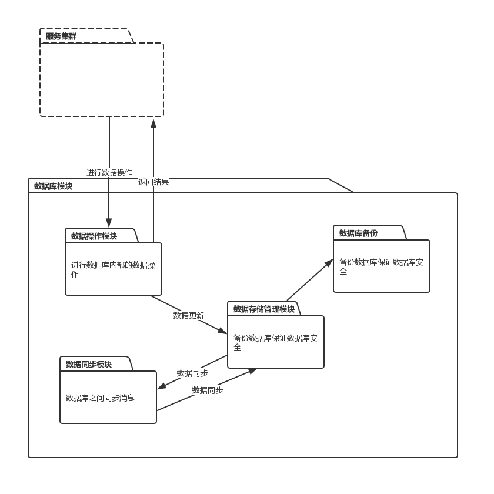

 

#### 3.6.6 评估

本次设计使用ADD方法对数据存储模块进行分解、细化，在考虑各质量属性的同时，兼顾了系统的实际成本（数据库存储），并在系统性能、可伸缩性、可移植性、可靠性及可用性之间做了权衡，较好的兼顾了上述各质量属性。

 

 

### 3.7 最终架构视图

1. **C&C视图**

2. **Module视图**

 

 

 

## IV. 对CS架构应用ADD

### 4.1 迭代一

## 4.1.1 需求信息

此处的ASR与分布式微服务架构设计ADD过程所列相同

 

####  4.1.2 分解的系统组件

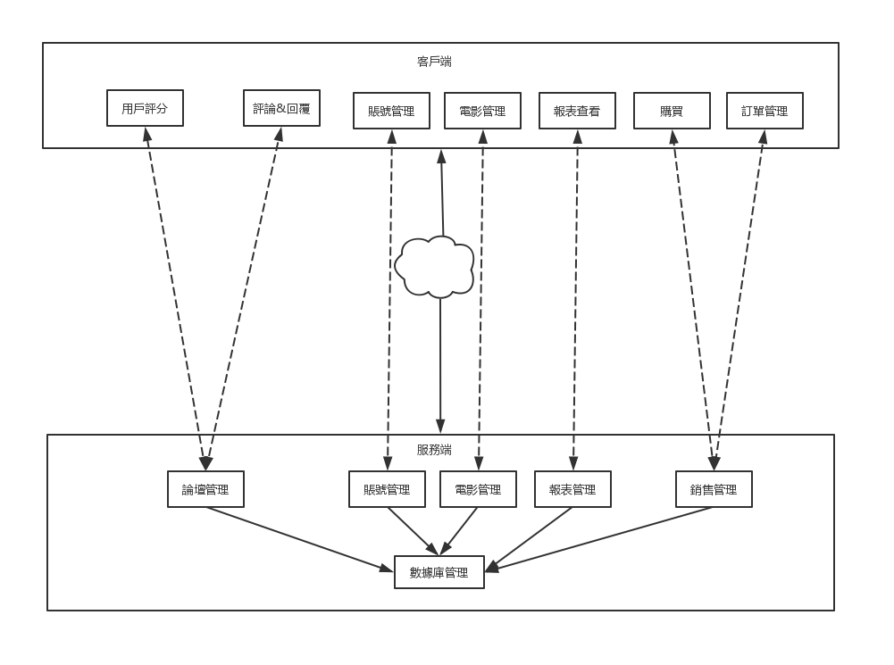

 

 

### 4.2. 迭代二

#### 4.2.1 需求信息

与迭代一相同

 

#### 4.2.2 分解的系统组件

我们选择销售管理模块进行分解。销售管理模块是系统的核心模，其主要功能为购票、退票、改签和查看订单

 

#### 4.2.3 组件负责的ASR

| 架构驱动                              | 重要性   | 难易度   |
| ------------------------------------ | -------- | -------- |
| 场景1：>100的用户同时购买同一场电影的票 | 高 | 高 |
| 场景2：用户进行正确操作                | 高 | 中 |
| 场景3：用户进行错误操作                | 高 | 高 |
| 场景10：未登录的用户进行购票操作        | 高 | 中 |
| 场景12：用户网络不稳定或失去连接        | 中 | 高 |

 

#### 4.2.4 为ASR进行设计

1. **设计关注点**

| 质量属性 | 设计关注点    | 子关注点 |
| ------- | ------------ | ------ |
| 可用性  | 网络连接      | 网络失效处理 |
| 安全性  | 防御攻击      | 对操作者进行身份认证 |
| 性能    | 响应时间  		| 提高响应速度 |
|         |              | 减少请求数量 |
| 可靠性  | 错误检测与反馈 | 表单验证 |
|         |              | 反馈与提示 |
|         | 并发操作      | 资源同步 |

 

2. **关注点的候选模式**
  
  - **网络失效处理**
    
    | #    | 模式名称           | 时间开销 | 资源开销 | 成功概率 |      |
    | ---- | ------------------ | -------- | -------- | -------- | ---- |
    | 1    | 提示用户主动刷新   | 中       | 低       | 高       |      |
    | 2    | 一定时间内自动重连 | 中       | 高       | 中       |      |
    | 3    | 组合模式           | 中       | 高       | 高       |      |

    - **选择的模式及理由**
    
      选择模式#3。在预定的响应时间内没有响应的情况下，系统返回正在加载的提示，后台尝试自动刷新重连。这种方式对易用性的支持也比较友好，模式一给用户一种系统崩溃的体验，模式二没有给用户任何提示，两者都没有很好地满足易用性。

  - **对操作者进行身份认证**
    
    | # | 模式名称          | 安全性 | 易用性 | 性能代价 |
    | - | ---------------- | ------ | ----- | -------- |
    | 1 | 帐号密码          | 低     | 高    | 低       |
    | 2 | 动态密码          | 高     | 低    | 中       |
    | 3 | 帐号密码 ＋ 验证码 | 高     | 高    | 中       |

    - **选择的模式及理由**
    
      选择模式#3。该模式不需要用户输入一大串无规律的动态密码，对用户友好，满足了易用性，加上随机生成的验证码能补充帐号密码的安全性不足。

  - **提高响应速度**
    
    | # | 模式名称          | 可靠性 | 成本 | 性能 |
    | - | ---------------- | ------ | --- | ---- |
    | 1 | 使用多线程处理    | 中     | 高   | 中   |
    | 2 | 增加硬件资源      | 高     | 高   | 高   |
    | 3 | 使用单线程异步I/O | 低     | 中   | 高   |
    | 4 | 使用请求队列      | 高     | 中   | 中   |

    - **选择的模式及理由**
    
      选择模式#4。模式#1需要额外处理并发的问题，还有线程上下文切换的性能代价，实现起来也比较有难度；模式#2无法从根本解决问题、成本太高、容易还到性能瓶颈；使用模式#3的话，单个错误导致系统崩溃，不满足本系统对可用性和可靠性的要求。

  - **减少请求数量**
    
    | # | 模式名称          | 易用性 | 安全性 | 成本 |
    | - | ---------------- | ------ | ----- | ---- |
    | 1 | 设置请求的时间间隔 | 低     | 高    | 中   |
    | 2 | 缓存              | 高     | 中    | 中   |

    - **选择的模式及理由**
    
      选择模式#2。模式#2对数据进行缓存，避免多次请求，减少服务器的压力。模式#1设置时间问隔，限制用户不能连续请求，降低用户操作的连贯性，不满足系统对易用性的要求。

  - **表单验证**
    
    | # | 模式名称           | 易用性 | 安全性 | 成本 | 可靠性 |
    | - | ----------------- | ------ | ----- | ---- | ------ |
    | 1 | 客户端验证         | 中     | 低    | 低   | 低     |
    | 2 | 服务器验证         | 低     | 中    | 中   | 高     |
    | 3 | 客户端、服务器验证  | 中     | 高    | 高   | 高     |

    - **选择的模式及理由**
    
      选择模式#3。模式#1无法保证数据的正确性，用户可绕过客户端的验证，实际上的安全性并不高；模式#2需发起请求后才能得到反馈，易用性相对较差，同时会增加服务器压力

  - **反馈与提示**
    
    | # | 模式名称              | 易用性 | 可用性 | 成本 |
    | - | -------------------- | ------ | ------ | ---- |
    | 1 | 提交时反馈和提示       | 低     | 低     | 低   |
    | 2 | 输入时反馈和提示       | 中     | 中     | 中   |
    | 3 | 提交、输入时反馈和提示 | 高     | 高     | 高   |

    - **选择的模式及理由**
    
      选择模式#3。模式#3可让用户在输入便知道是否输入错误，有更好的易用性。

  - **并发操作**
    
    | # | 模式名称                | 可扩展性 | 并发 | 成本 | 性能 |
    | 1 | ---------------------- | ------- | ---- | ---- | ---- |
    | 2 | 增加服务器，使用负载均衡 | 高       | 高   | 高   | 高   |
    | 3 | 增加服务器的硬件设备     | 中      | 低   | 高    | 高   |

    - **选择的模式及理由**
    
      选择模式#2。模式#1容易遇到性能瓶颈，性价比没有模式#1高，模式#1通过负载均衡，有效利用硬件设备，提高硬件的利用率。

3. **候选模式与对应ASR**

| 模式类型             | 选择的模式               | 架构驱动      |
| -------------------- | ------------------------ | ------------- |
| 网络失效处理         | 组合模式                 | 场景1、场景12 |
| 对操作者进行身份认证 | 帐号密码 ＋验证码        | 场景10        |
| 提高响应速度         | 请求队列                 | 场景1         |
| 减少请求数量         | 缓存                     | 场景1         |
| 表单验证             | 客户端、服务器验证       | 场景2、场景3  |
| 反馈和提示           | 提交、输入时反馈和提示   | 场景2、场景3  |
| 并发操作             | 增加服务器，使用负载均衡 | 场景1         |

 

#### 4.2.5 架构视图

1）C&C视图

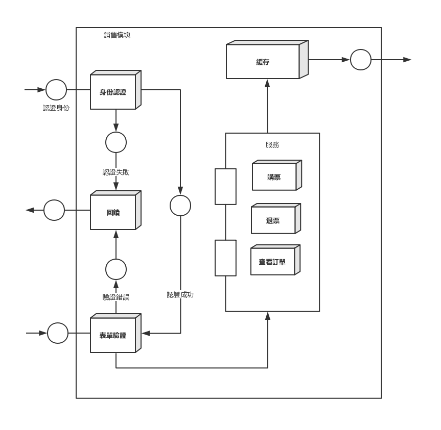

2）Module视图

 

#### 4.2.6 评估

此次设计没有冲突。

 

 

### 4.3 迭代三

#### 4.3.1 需求信息

参见「II. 项目需求信息」

 

#### 4.3.2 分解的系统组件

选择报表管理模块进行分解，该模块负责展示每部电影的销售情况，每个影院每次放映的上座率，用户画像等资料。

 

#### 4.3.3 组件负责的ASR

| 架构驱动                        | 重要性 | 难易度 |
| ------------------------------ | ------ | ------ |
| 功能需求6：报表查看              | 高     | 高     |
| 场景2：用户进行正确操作          | 高     | 中     |
| 场景4：客户端迁移到其他系统或环境 | 低     | 中     |
| 场景9：系统服务器无法正常运行     | 高     | 中     |
| 场景12：用户网络不稳定或失去连接  | 中     | 高     |

 

#### 4.3.4 为ASR进行设计

1. **设计关注点**

| 质量属性 | 设计关注点    | 子关注点           |
| ------- | ------------ | ------------------ |
| 易用性   | 报表展示     | 报表展示方式 |
| 可移植性 | 多终端适配   | 适应不同设备的屏幕尺寸 |
| 安全性   | 资源访问安全 | 不同身份用户的查看权限 |
| 可用性   | 网络中断     | 网络状态检测 网络中断处理方法 |

2. **关注点的候选模式**

  - **报表展示方式**
  
    | # | 模式名称         | 易用性 | 难度 |
    | - | --------------- | ------ | ---- |
    | 1 | 使用统计图表展示 | 中     | 中   |
    | 2 | 使用列表展示     | 低     | 低   |
    | 3 | 组合模式        | 高      | 高   |

    - **选择的模式及理由**
      
      选择使用组合模式展示。因为统计图表能更直观地反映数据变化和各项之间的比较情况，而列表更适合数据导出和传输，因此有更高的易用性。

  - **适应不同设备的屏幕尺寸**
    
    | # | 模式名称              | 可移植性 | 难度 |
    | - | -------------------- | -------- | --- |
    | 1 | 响应式设计            | 高       | 中  |
    | 2 | 为各种屏幕单独设计界面 | 高       | 高  |

    - **选择的模式及理由**
      
      选择使用响应式设计。因为响应式设计能够很好的适应不同的屏幕尺寸，且开发成本更低。虽然为各种屏幕单独设计界面能有更好的可移植性和易用性，但是设计成本、开发成本和维护成本太高，权衡之下，选择响应式设计。

  - **不同身份用户的查看权限**
    
    | # | 模式名称           | 安全性 | 性能 | 成本 | 难度 |
    | - | ----------------- | ------ | --- | ---- | ---- |
    | 1 | 过滤器拦截请求      | 高    | 中   | 低   | 中   |
    | 2 | OAuth 2.0 认证授权 | 高     | 高  | 高   | 高   |

    - **选择的模式及理由**
      
      选择 OAuth 2.0 认证授权。两者都能实现基于角色的权限控制，OAuth 2.0 只需在最初授权时查询一次用户角色，后续只需验证 token，性能更好，所以选择 OAuth 2.0 认证授权。

  - **网络状态检测**
    
    | # | 模式名称     | 可用性 | 客户端成本 | 服务端成本 |
    | - | ----------- | ------ | --------- | --------- |
    | 1 | Ping / echo | 高     | 中        | 中         |
    | 2 | Heartbeat   | 高     | 低        | 高         |

    - **选择的模式及理由**
      
      选择Ping / echo。因为当客户端规模增长到一定数量时，Heartbeat 模式会建立大量连接，使服务器负担过重，而Ping / echo 利用了客户端计算资源，减轻了服务器压力。

  - **网络中断处理方法**
    
    | # | 模式名称             | 可用性 | 成功率 | 成本 |
    | - | -------------------- | ----- | ----- | ---- |
    | 1 | 客户端重试请求        | 中    | 中     | 中   |
    | 2 | 客户端提示网络断开    | 低     | 高    | 低   |
    | 3 | 客户端使用离线缓存数据 | 高    | 高    | 高    |

    - **选择的模式及理由**
      
      选择客户端使用离线缓存数据。因为报表对实时性要求不高，使用离线的缓存数据生成报表能使系统在离线模式下正常运行，提高系统的可用性。当没有离线缓存数据时，考虑使用客户端提示网络断开。

3. **候选模式与对应ASR**

| 模式类型             | 选择的模式            | 架构驱动        |
| -------------------- | ------------------- | --------------- |
| 报表展示方式          | 组合模式             | 功能需求6，场景2 |
| 适应不同设备的屏幕尺寸 | 响应式设计           | 场景4           |
| 不同身份用户的查看权限 | OAuth 2.0 认证授权   | 功能需求6       |
| 网络状态检测          | Ping / echo          | 场景9          |
| 网络中断处理方法      | 客户端使用离线缓存数据 | 场景12         |

 

#### 4.3.5 架构视图

1. **C&C视图**

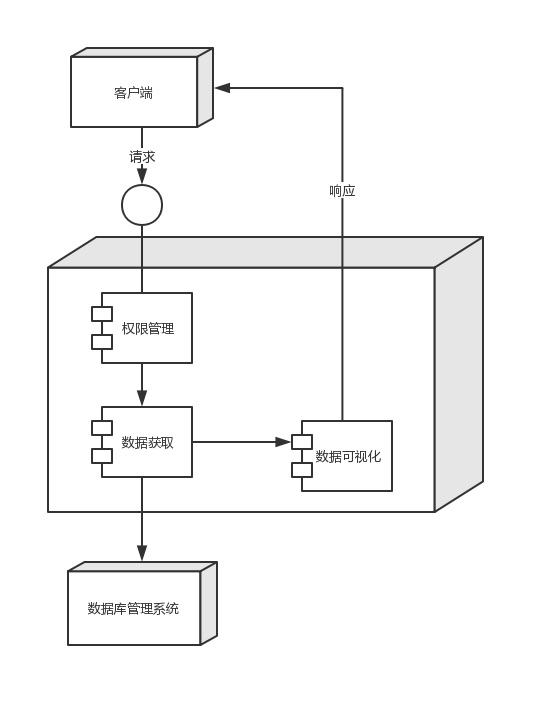

2. **Module视图**

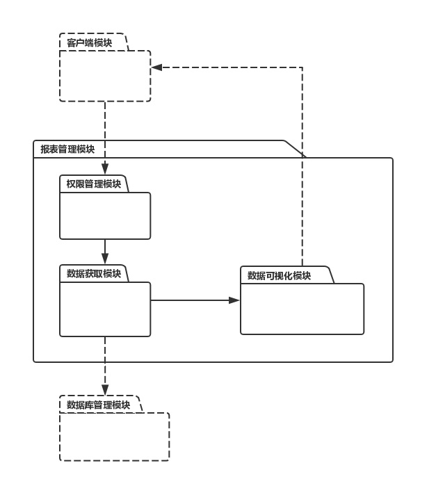

 

#### 4.3.6 评估

此次设计完成良好，没有冲突。

 

 

### 4.4 迭代四

#### 4.4.1 需求信息

参见「II. 项目需求信息」

 

#### 4.4.2 分解的系统组件

选择分解服务器端的数据库接口模块

 

#### 4.4.3 组件负责的ASRs

| 架构驱动                              | 重要性 | 难易度 |
| ------------------------------------ | ------ | ------ |
| 场景1：\>100的用户同时购买同一场电影的票 | 中     | 高     |
| 场景2：用户进行正确操作                | 高     | 低     |
| 场景3：用户进行错误操作                | 高     | 中     |
| 场景5：系统加入新的功能和服务           | 中     | 中     |
| 场景6：数据库崩溃                      | 中     | 高     |
| 场景7：增加新的硬件设施                | 低     | 中     |
| 场景8：修改系统已有功能                | 中     | 中     |
| 场景10：未登陆用户进行操作             | 高     | 中     |

 

#### 4.4.4 为ASR进行设计

1. **设计关注点**

| 设计关注点     | 子关注点       |
| ------------- | ------------- |
| 数据存储方式   | 数据库结构     |
| 数据库性能     | 高并发处理能力 |
| 数据库可靠性   | 数据库容灾能力 |
|               | 数据库安全性   |
| 数据库可扩展性 | 垂直扩展能力   |
|               | 水平扩展能力   |

2. **关注点的候选模式**

  - **数据库结构**

    | # | 模式名称       | 可靠性 | 安全性 | 灵活性 |
    | - | ------------- | ----- | ----- | ------ |
    | 1 | 关系型数据库   | 高    | 高     | 中     |
    | 2 | 非关系型数据库 | 中    | 中     | 高     |

    - **选择的模式及理由**
      
      选择关系型数据库。关系型数据库更加稳定和成熟，拥有更加完善的社区和生态，针对不同需求（并发，安全等）都有相应的解决途径。尽管非关系型数据库在可扩展型方面略胜一筹，但是由于项目的规模，无法完全发挥非关系型数据在大数据环境下的优势。因此选择关系型数据库。

  - **高并发处理能力**

    | # | 模式名称     | 并发读的性能 | 并发写的性能 |
    | - | ----------- | ------------ | ------------ |
    | 1 | 悲观并发控制 | 低           | 高           |
    | 2 | 乐观并发控制 | 高           | 低           |

    - **选择的模式及理由**
      
      选择悲观并发控制。因为系统可预见的高并发场景是场景1，其中以写为主。如果采用乐观锁，可能会经常产生冲突，导致上层应用不断持行尝试，从而降低性能。

  - **数据库容灾能力**

      | # | 模式名称    | 节点数 | 空间成本 | 实现难度 |
      | - | ---------- | ------ | -------- | -------- |
      | 1 | log        | 单     | 高       | 中       |
      | 2 | checkpoint | 单     | 中       | 中       |
      | 3 | 主人-奴隶   | 多     | 高       | 高       |

      - **选择的模式及理由**
      
        选择主人-奴隶模式。因为当出现硬件故障或磁盘故障时，前两种方案无法恢复数据，只有采用第三种集群级別的容灾方案，即使主库因为不可抗拒的原因无法恢复数据，仍然可以在从库中恢复数据。

  - **数据库安全性**

      | # | 模式名称     | 复杂度 | 对效率的影响 |
      | - | ----------- | ------ | ------------ |
      | 1 | 全盘加密     | 低     | 低           |
      | 2 | 文件加密     | 低     | 低           |
      | 3 | 库内扩展加密 | 中     | 低           |

      - **选择的模式及理由**
      
        选择库内扩展加密。因为前两种方式对于数据库管理系统来说是透明的，且无法防止控制了操作系统的攻击者。而库内扩展加密利用视图触发器等数据库本身的机制，对于不同用户，控制其对敏感数据的访问权限，符合场景3和10的要求

  - **数据库水平扩展能力**

      | # | 模式名称  | 效果        | 实现难度 |
      | - | -------- | ----------- | -------- |
      | 1 | 业务拆分  | 减少读写压力 | 低       |
      | 2 | 数据分片  | 扩大写容量   | 高       |

      - **选择的模式及理由**
        选择业务拆分。因为电影购票业务与电影评分业务性质差异较大，有不同的侧重点，适用于业务拆分策略。另外，数据分片的难度较高，例如要处理全局数据和缓存。

3. **候选模式与对应ASR**

   | 模式类型       | 选择的模式   | 架构驱动        |
   | ------------- | ----------- | --------------- |
   | 数据库结构     | 关系型数据库 | 场景5, 6, 8, 10 |
   | 高并发处理能力 | 悲观并发控制 | 场景1, 2        |
   | 数据库容灾能力 | 主人-奴隶    | 场景6           |
   | 数据库安全性   | 库内扩展加密 | 场景3，场景10   |
   | 水平扩展能力   | 业务拆分     | 场景7           |

 

#### 4.4.5 架构视图

1. **C&C视图**

2. **Module视图**

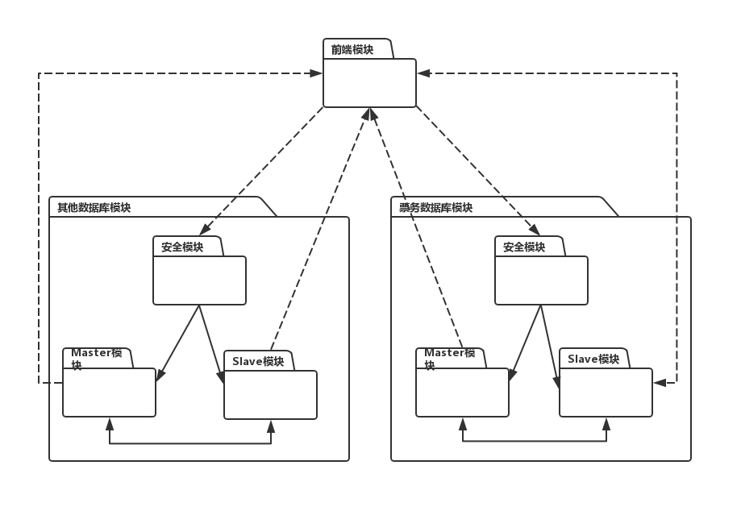

 

#### 4.4.6 评估

此次设计完成良好，没有冲突。

 

 

### 4.5 迭代五

#### 4.5.1 需求信息

同迭代一。

 

#### 4.5.2 分解的系统组件

此次迭代选择电影管理模块进行分解，该模块主要面向管理员，提供电影的上架、排片、下架和信息管理等功能。

 

#### 4.5.3 组件负责的ASRs

| 架构驱动                        | 重要性 | 难易度 |
| ------------------------------ | ------ | ----- |
| 场景2：用户进行正确操作          | 高     | 中     |
| 场景3：用户进行错误操作          | 高     | 高     |
| 场景4：客户端迁移到其他系统或环境 | 低     | 中     |
| 场景12：用户网络不稳定或失去连接  | 中     | 高     |

 

#### 4.5.4 为ASR进行设计

1. **设计关注点**

| 质量属性 | 设计关注点     | 子关注点         |
| ------- | -------------- | --------------- |
| 可用性   | 网络中断       | 断网处理方法     |
| 安全性   | 操作权限安全   | 敏感操作身份验证 |
| 鲁棒性   | 错误检测与阻止 | 提交数据验证     |
| 可移植性 | 多平台适配     | 适配不同操作系统 |
| 易用性   | 信息管理       | 信息搜索        |

2. **关注点的候选模式**

  - **断网处理方法**
    
    | # | 模式名称     | 可用性 | 实现难度 |
    | - | ----------- | ------ | ------- |
    | 1 | 提示网络断开 | 低     | 低       |
    | 2 | 自动尝试重连 | 中     | 中       |
    | 3 | 进入离线模式 | 高     | 高       |
    | 4 | 组合模式     | 高     | 高      |

    - **选择的模式及理由**
      
      选择组合模式。因为管理电影操作本身并不需要很强的实时性，离线模式下将操作保存下来，待网络恢复后再提交也可接受；而其他模式可用性较差，且不便于使用。

  - **敏感操作身份验证**
    
    | # | 模式名称            | 安全性 | 易用性 | 成本 |
    | - | ------------------ | ------ | ----- | ---- |
    | 1 | 状态异常时禁止操作   | 高     | 高    | 高   |
    | 2 | 输入密码二次认证     | 中     | 中    | 低   |
    | 3 | 输入独立密码二次认证 | 高     | 低    | 低   |
    
    - **选择的模式及理由**
    
      选择输入独立密码二次认证模式。因为对电影的上架、下架和信息修改等操作较为敏感，要采取措施防止意外；而状态异常的检测和判断难度较大，本阶段暂不考虑。

  - **提交数据验证**
  
    | # | 模式名称   | 鲁棒性 | 安全性 | 易用性 | 成本 |
    | - | --------- | ------ | ----- | ------ | ---- |
    | 1 | 客户端验证 | 中     | 低    | 高     | 低   |
    | 2 | 服务端验证 | 高     | 高    | 中     | 中   |
    | 3 | 组合模式   | 高     | 高    | 高     | 高   |
    
    - **选择的模式及理由**
    
      选择组合模式。因为对电影的信息修改等操作较为敏感，有必要对客户端传来的数据进行验证；而同时选择客户端验证便于用户及时收到反馈，缓解服务端部分压力。

  - **适配不同操作系统**

    | # | 模式名称              | 可移植性 | 性能 | 成本 |
    | - | -------------------- | -------- | --- | ---- |
    | 1 | 为不同平台独立开发     | 低       | 高  | 高   |
    | 2 | 使用跨平台技术统一开发 | 高       | 中  | 低   |
    
    - **选择的模式及理由**
      
      选择跨平台技术统一开发模式。因为电影管理模块没有太高的性能需求，而又经常面对更换服务器平台、支持多平台客户端的需求求，跨平台统一开发更为方便。

  - **信息搜索**
    
    | # | 模式名称   | 易用性 | 实现难度 |
    | - | --------- | ------ | ------- |
    | 1 | 按名称搜索 | 中     | 低      |
    | 2 | 按时间搜索 | 中     | 低      |
    | 3 | 按类型搜索 | 中     | 低      |
    | 4 | 组合模式   | 高     | 中      |
    
    - **选择的模式及理由**
    
      选择组合模式。因为搜索场景使用较为广泛，组合搜索能提供最大的易用性。

 

3. **候选模式与对应ASR**

| 模式类型         | 选择的模式             | 架构驱动 |
| --------------- | --------------------- | -------- |
| 断网处理方法     | 组合模式               | 场景12   |
| 敏感操作身份验证 | 输入独立密码二次认证模式 | 场景2    |
| 提交数据验证     | 组合模式               | 场景3    |
| 适配不同操作系统 | 跨平台技术统一开发模式   | 场景4    |
| 信息搜索        | 组合模式                | 场景2    |

 

#### 4.5.5 架构视图

1. **C&C视图**

2. **Module视图**

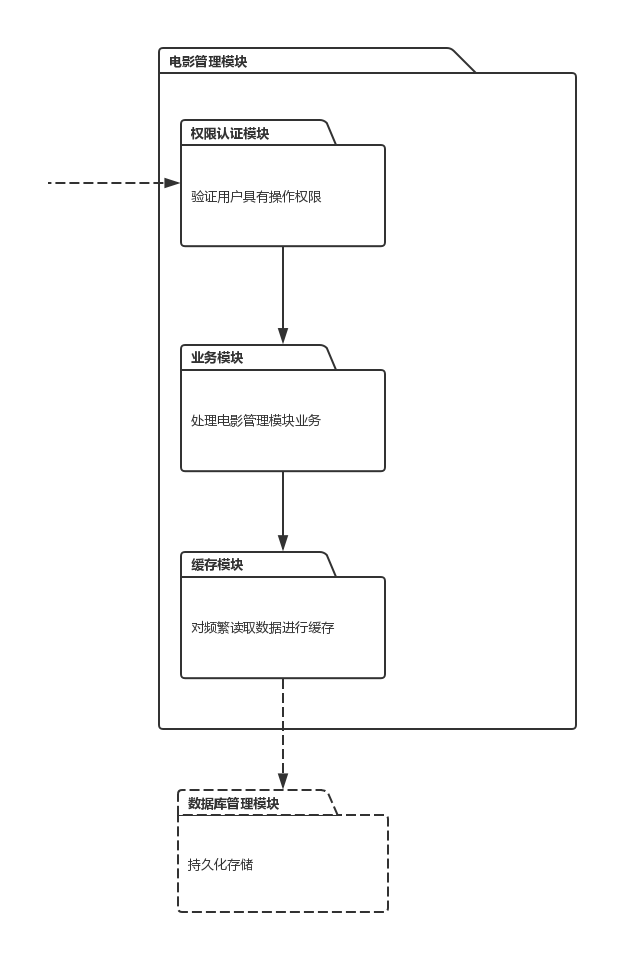

 

#### 4.5.6 评估

本次迭代没有发现冲突。

 

 

### 4.6 最终架构视图

#### 4.6.1 模块视图

1. **C&C视图**

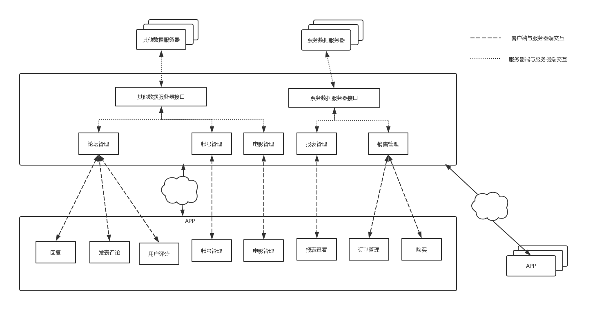

2. **Module视图**

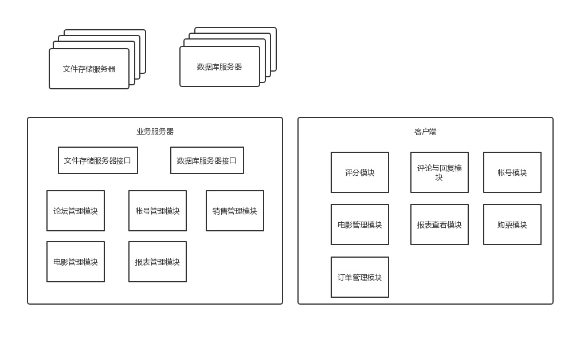

3. **客户端与服务器视图**

 

 

 

## V. 架构模式对比

### 5.1 综述

CS架构更适合中小型系统的开发，在低并发的场景下拥有更高的性能，而微服务架构更适合大型系统的开发，在高并发场景下拥有更高的性能，而且可用性好于CS架构。

CS架构复杂度低，前期开发成本较小，但后期维护成本更高，而微服务架构复杂度高，前期开发成本昂贵，但是后期维护成本低，而且拥有更好的可伸缩性和可扩展性，可以灵活的增加或移除服务。

 

### 5.2 性能

| 微服务架构                                                   | CS架构                                                       |
| ------------------------------------------------------------ | ------------------------------------------------------------ |
| 低并发情况下，服务间需要通信，会受到网络延迟，消息传递等影响，降低性能 | 低并发情况下，通过共享内存访问进行通信，性能更好             |
| 高并发情况下，可以为单个服务增加计算资源，其他服务的性能不会受到影响，性能更好 | 高并发情况下，单台服务器的存储能力和处理能力会成为约束性能的瓶颈，而且单个功能会消耗更多的计算资源，降低其他功能的性能 |

 

### 5.3 可用性

| 微服务架构                                                   | CS架构                                     |
| ------------------------------------------------------------ | ------------------------------------------ |
| 分离的服务有更好的容错性，正常情况下一台服务器宕机不会使整个系统崩溃，有更好的可用性 | 错误会对整个应用的稳定产生影响，可用性更低 |

 

### 5.4 安全性

| 微服务架构                                                   | CS架构                                                 |
| ------------------------------------------------------------ | ------------------------------------------------------ |
| 分离的服务开放了更多的端口，增大了攻击面，部署安全措施更复杂 | 模块集中，攻击面小，容易部署安全措施                   |
| 外界与服务的通信可通过API网关进行身份认证，服务间通信可通过加密协议验证身份，安全性高 | 客户端与服务端的通信可通过拦截器进行身份认证，安全性高 |

 

### 5.5 成本

| 微服务架构                                                   | CS架构                                           |
| ------------------------------------------------------------ | ------------------------------------------------ |
| 结构复杂，开发成本更高                                       | 结构简单，复杂度低，开发的成本更低               |
| 服务之间相互分离，容易对某个服务进行修改和重新部署，维护成本较低 | 模块之间耦合度更高，维护成本更高                 |
| 低并发量需要更多的计算资源，硬件成本更高                     | 低并发量需要更少的计算资源，硬件成本更低         |
| 高并发量下，可以对单个服务进行伸缩，硬件成本更低             | 高并发量下，需要对整个应用进行伸缩，硬件成本更高 |

 

### 5.6 可测试性

| 微服务架构                               | CS架构                       |
| ---------------------------------------- | ---------------------------- |
| 测试前需要确认依赖的服务，降低了可测试性 | 将应用整体打包，更加容易测试 |

 

### 5.7 结论

考虑到高并发、高可用的需求，相较于CS架构，微服务架构的表现更好，因此最终选择微服务架构。

 

 

## VI. 上下文图、UML类图及其映射

1. **上下文图**
  
   

2. **UML类图**
  
   
   
3. **类的映射**
  
   | 模块         | 组件            | 类 |
   | ----------- | --------------- | - |
   |      服务集群       | 业务模块         | ConcreteService, ConcreteServiceImpl |
   |             | 权限认证模块      | ServiceDispatcher |
   |             | 服务监控模块      | StatusUpdater |
   |             | 数据库模块       | DaoFactory |
   |             | 外部系统交流模块 | ExternalInterface |
   | 注册集群     |                 | |
   | 通信机制模块 | 数据接收模块     | Receiver, ReceiverImpl |
   |             | 数据校验模块     | Validator, ParityChecker |
   |             | 任务优先队列模块 | QueryOrder |
   |             | 加密模块         | Encryptor, Ssl_TslImpl |
   |             | 数据发送模块     | Sender, SenderImpl |
   |             | 通信检测模块     | ConnectionChecker, HearbeatImpl |
   |  API网关            | 身份认证，访问控制模块 | SecurityCheck, RequestHandler |
   |             | 缓存模块        | ServiceCache |
   |             | 请求解析模块     | RequestHandler, RestController |
   |             | HeartBeat模块   | ServiceFinder |
   |             | 请求转发模块     | RPCProxy      |
   |             | 负载均衡模块     | RPCProxy      |
   | 数据存储模块 | 存储服务器       | User, Movie, Cinema, Picture, LongText, Video |
   |             | 文件存储模块     | PictureDao, PictureDaoImpl, LongTextDao, LongTextDaoImpl, VideoDao, VideoDaoImpl |
   |             | 数据库          | UserDao, UserDaoImpl, MovieDao, MovieDaoImpl, CinemaDao, CinemaDaoImpl |
   |             | 后台管理系统     | StateService |
   |             | 数据库操作       | SqlGenerator, SqlGeneratorImpl |

 

 

## VII. 总结

### 7.1 挑战与经验

在本次作业刚开始时，我们对于分布式和微服务架构还知之甚少，因此弄清该架构的一些实现细节——如不同节点间的通信和同步机制，就是一个不小的挑战。我们为此查阅了大量相关资料，参考学习了几个公司或组织构建的分布式系统，最终完成了对该架构的设计和分析。经过这次学习，我们对分布式微服务有了更深的了解。

 

### 7.2 组员分工

| 姓名   | 学号      | 分工 |
| ------ | --------- | ---- |
| 陈骁   | 161250014 |      |
| 吉宇哲 | 161250047 |      |
| 赖健明 | 161250051 |      |
| 连远翔 | 161250065 |      |
| 何天⾏ | 161250039 |      |
| 胡本霖 | 161250042 |      |
| 乐盛捷 | 161250053 |      |
| 雷诚   | 161250054 |      |

