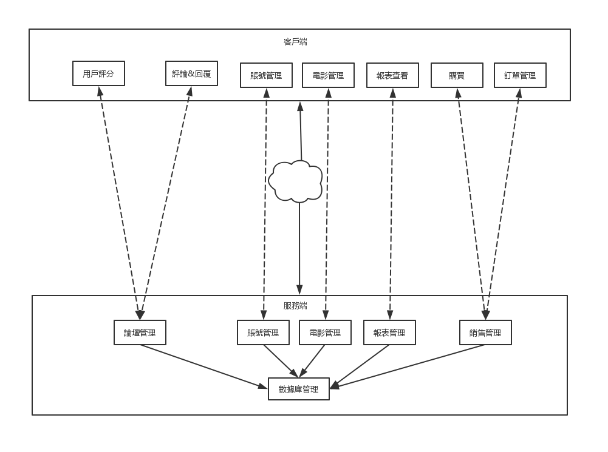

# 电影评分系统——项目文档

 

## 小组成员

| 姓名   | 学号      |
| ------ | --------- |
| 陈骁   | 161250014 |
| 吉宇哲 | 161250047 |
| 赖健明 | 161250051 |
| 连远翔 | 161250065 |
| 何天⾏ | 161250039 |
| 胡本霖 | 161250042 |
| 乐盛捷 | 161250053 |
| 雷诚   | 161250054 |

 

 

## 目录

[TOC]

 

 

 

## I.候选架构

### 1.1 分布式微服务架构

分布式系统具有更⾼的可延展性，当单个硬件的能⼒达到瓶颈时，通过增加数量来提⾼系统整体的性能。采⽤分布式系统可以在架构上对未来的⽤户增⻓长和数据增⻓长作好准备。卖票功能与地理位置关系密切，分布式系统可以根据⽤户所在地理位置，选择较近的结点作出反应，从⽽减少延迟，提升⽤户体验。此外，分布式系统的容错性，当某结点的出现意外，其他结点仍然可以正常运⾏，提⾼系统的可⽤性。

 

 

### 1.2 CS架构

Client-Server架构将系统拆分为服务端和客户端，客户端⽆须关⼼服务端的内部实现，仅通过⽹络调⽤服务器提供接⼝即可，这降低了客户端和服务端之间的耦合，同时隐藏了数据的储存策略，另外服务端和客户端可採⽤两种的硬件设备，对于计算要求较⾼的服务端，则可以採⽤⾼性能的硬件设备，客户端则不需，从⽽降低成本。服务器和客户端之间的职责明确清晰，这使得服务端和客户端可同时开发，降低开发的时间成本。

 

 

 

## II. 项目需求信息

### 2.1 项目的功能需求

- ⽤户购票：⽤户可以在平台上选择影院或电影查看上映，然后对电影进⾏选票的操作
- 发表评论：⽤户可以在观影完成后对电影进⾏评分和评论操作。
- 回复评论：⽤户可以看到其他⽤户的评分和评论，并可以对其他⽤户的评论进⾏评论、或者“顶/踩”操作。
- 账户管理：⽤户可以设置个⼈信息，包括昵称、⼿机号、密码、感兴趣电影类型等信息
- 订单管理：⽤户可以对已经购买的电影订单进⾏查看、退票、改签等操作。
- 报表查看：管理员可以查看每部电影的销售情况或者每个影院每次放映的的上座率，⽤户画像等资料
- 电影管理：管理员可以对电影进⾏上架、排⽚和下架操作。

 

 

### 2.2 应用场景

获得样本输入，筛选掉不必要的需求，列出 ASR：

#### Scenario 1：\>100的用户同时购买同一场电影的票（可靠性reliability、性能performance）

| 场景组成部分 | 可能的值                                                     |
| ------------ | ------------------------------------------------------------ |
| 源           | 系统用户                                                     |
| 刺激         | \>100的用户同时购买同一场电影的票                            |
| 制品         | 系统的负载均衡模块、业务模块和数据库系统                     |
| 环境         | 系统正常运行                                                 |
| 响应         | 系统帮助用户正常完成购买操作 服务器端的数据库中的数据正常修改 客户端用户界面及时刷新 |
| 响应度量     | 98%以上的用户请求可以正常完成 90%以上的用户请求在1s内完成 |

 

#### Scenario 2：用户进行正确操作（易用性usability）

| 场景组成部分 | 可能的值                                                     |
| ------------ | ------------------------------------------------------------ |
| 源           | 系统用户                                                     |
| 刺激         | 用户执行正常操作                                             |
| 制品         | 系统的客户端和服务器端                                       |
| 环境         | 系统正常运行                                                 |
| 响应         | 用户的操作得到期望的反馈 软件的操作简单易学、可以快速掌握 |
| 响应度量     | 90%以上的用户可以在30min内熟练使用本系统 98%以上的用户可以正确使用本系统完成任务 |

 

#### Scenario 3：用户进行错误操作（可靠性reliability）

| 场景组成部分 | 可能的值                                                     |
| ------------ | ------------------------------------------------------------ |
| 源           | 系统用户                                                     |
| 刺激         | 用户执行错误操作                                             |
| 制品         | 系统的客户端的错误处理模块                                   |
| 环境         | 系统正常运行                                                 |
| 响应         | 用户的操作被拒绝 系统提示错误信息 系统告知用户可能的解决办法 |
| 响应度量     | 系统在2s内确认错误操作，并给用户错误提示信息                 |

 

#### Scenario 4：客户端迁移到其他系统或环境（可移植性Portability）

| 场景组成部分 | 可能的值                                                     |
| ------------ | ------------------------------------------------------------ |
| 源           | 开发人员、维护人员                                           |
| 刺激         | 客户端或者服务端迁移到新的环境                               |
| 制品         | 客户端、服务端                                               |
| 环境         | 系统开发环境、或者系统维护和配置时                           |
| 响应         | 系统成功部署到运行环境 系统完成修改并通过所有测试        |
| 响应度量     | 完成部署和移植的代价为1个人月 移植成本占总成本的比例不得高于5% |

 

#### Scenario 5：为系统加入新的功能和服务（可扩展性Extensibility、可维护性Maintainability）

| 场景组成部分 | 可能的值                                                     |
| ------------ | ------------------------------------------------------------ |
| 源           | 系统开发人员                                                 |
| 刺激         | 系统需要加入新的功能                                         |
| 制品         | 新添加的业务模块                                             |
| 环境         | 系统运行环境，系统正常运行                                   |
| 响应         | 新的功能成功部署 客户端正常更新                          |
| 响应度量     | 系统的发布不会影响99%以上用户的正常使用 添加系统功能时服务器维护时间在2小时以内 |

 

#### Scenario 6：数据库崩溃（可用性avibility、安全性Security）

| 场景组成部分 | 可能的值                                                     |
| ------------ | ------------------------------------------------------------ |
| 源           | 系统开发人员、系统维护人员                                   |
| 刺激         | 数据库无法提供正常服务                                       |
| 制品         | 数据库系统、错误处理模块                                     |
| 环境         | 系统运行环境，系统正常运行；或者系统整体测试时               |
| 响应         | 尽快恢复数据库的正常功能 根据日志等记录信息定位崩溃原因  |
| 响应度量     | 在1h内使数据库恢复到可以正常工作的状态 在3个人日内查明并修复造成崩溃的原因 |

 

#### Scenario 7：增加新的硬件设施（可伸缩性scability）

| 场景组成部分 | 可能的值                                           |
| ------------ | -------------------------------------------------- |
| 源           | 系统开发人员、系统维护人员                         |
| 刺激         | 服务器端需要增加新的硬件设施                       |
| 制品         | 机房硬件                                           |
| 环境         | 系统运行环境，系统正常运行                         |
| 响应         | 系统的正常运行和功能不受影响                       |
| 响应度量     | 在2h内完成系统的维护 98%的用户访问不会受到影响 |

 

#### Scenario 8：修改系统已有的功能（可修改性Modifibility）

| 场景组成部分 | 可能的值                                                 |
| ------------ | -------------------------------------------------------- |
| 源           | 系统开发人员                                             |
| 刺激         | 服务器端的代码需要重新部署                               |
| 制品         | 服务器端业务模块                                         |
| 环境         | 系统运行环境，系统正常运行                               |
| 响应         | 系统的正常运行和功能不受影响                             |
| 响应度量     | 在2h内完成功能的修改和部署 98%的用户访问不会受到影响 |

 

#### Scenario 9：系统服务器无法正常运行（可用性availability）

| 场景组成部分 | 可能的值                                                     |
| ------------ | ------------------------------------------------------------ |
| 源           | 系统服务器                                                   |
| 刺激         | 系统服务器崩溃，无法提供服务                                 |
| 制品         | 服务器端业务模块                                             |
| 环境         | 系统服务器出现故障，无法正常运行                             |
| 响应         | 查明服务器故障原因，修复系统故障 记录并保存故障日志 通知访问的用户相应的功能暂时无法使用 解决问题并重启服务器 |
| 响应度量     | 在3h内查明并修复故障 保证服务器在99%以上的运行时间内正常工作 |

 

#### Scenario 10：未登录的用户进行购票操作（安全性security）

| 场景组成部分 | 可能的值                                                     |
| ------------ | ------------------------------------------------------------ |
| 源           | 未经授权的个人或者其他系统用户                               |
| 刺激         | 进行购票和支付操作                                           |
| 制品         | 系统的用户管理模块                                           |
| 环境         | 系统正常运行，但是用户没有登录                               |
| 响应         | 系统拒绝用户进行相应操作，并提示用户进行登录                 |
| 响应度量     | 在2s内拒绝未登录的用户进行操作 在拒绝请求之后记录相应的日志 |

 

#### Scenario 11：系统出现功能缺陷（可测试性testability）

| 场景组成部分 | 可能的值                                                     |
| ------------ | ------------------------------------------------------------ |
| 源           | 开发者                                                       |
| 刺激         | 开发者发现系统存在BUG                                        |
| 制品         | 修复BUG的系统                                                |
| 环境         | 系统开发过程中，或者系统正常运行，                           |
| 响应         | 通过测试定位出现BUG的代码块 修改系统BUG，并测试修改后的代码 部署新的代码并重新启动系统 |
| 响应度量     | 在1h内定位出现BUG的代码块 在6h内修复系统BUG并通过测试 在2h内完成新代码的部署工作 |

 

#### Scenario 12：用户网络不稳定或失去连接（可用性availability）

| 场景组成部分 | 可能的值                                                     |
| ------------ | ------------------------------------------------------------ |
| 源           | 用户所处的网络环境                                           |
| 刺激         | 网络不稳定或失去连接                                         |
| 制品         | 用户进行的操作                                               |
| 环境         | 客户端软件在无网络或网络不稳定的环境下运行                   |
| 响应         | 保存用户的操作和相应的信息 及时告知用户网络存在问题 等到网络状况良好时重新进行操作 |
| 响应度量     | 用户的操作和信息在0.5s内保存 在1s内告知用户相应的问题 检测到网络连接状况良好时，在1s内重新进行操作 |

 

 

 

## III. 对分布式微服务架构应用ADD

### 3.1 迭代一

#### 3.1.1 需求信息

参见「II. 项目需求信息」

 

#### 3.1.2 分解的系统组件

选择报表管理模块进行分解，该模块负责展示每部电影的销售情况，每个影院每次放映的上座率，用户画像等资料。

 

#### 3.1.3 组件负责的ASR

| 架构驱动                | 重要性 | 难易度 |
| ----------------------- | ------ | ------ |
| 功能需求6：报表查看     | 高     | 高     |
| 场景2：用户进行正确操作 | 高     | 中     |

 

#### 3.1.4 为ASR进行设计

1. **设计关注点**

| 质量属性 | 设计关注点 | 子关注点 |
| ------ | --------- | ------ |
|  可用性  | 容错处理 | 服务转发机制 |
|          |            | 服务地址失效处理 |
|          | 服务监控 | 和注册中心保持连接 |
| 性能 | 提高响应速度 | 缓存方式 |

2. **关注点的候选模式**

XXX

3. **候选模式与对应ASR**

| 模式类型     | 选择的模式         | 架构驱动      |
| ------------ | ------------------ | ------------- |
| 服务转发机制 | 对发挥的地址再确认 | 场景1、场景12 |

 

#### 3.1.5 架构视图

1. **C&C视图**

2. **Module视图**

 

#### 3.1.6 评估

XXX

 

 

### 3.2 迭代二

#### 3.1.1 需求信息

参见「II. 项目需求信息」

...

 

 

 

## IV. 对CS架构应用ADD

### 4.1 迭代一

#### 4.1.1 需求信息

此处的ASR与分布式微服务架构设计ADD过程所列相同

 

####  4.1.2 分解的系统组件

 

 

### 4.2. 迭代二

#### 4.2.1 需求信息

与迭代一相同

 

#### 4.2.2 分解的系统组件

我们选择销售管理模块进行分解。销售管理模块是系统的核心模，其主要功能为购票、退票、改签和查看订单

 

#### 4.2.3 组件负责的ASR

| 架构驱动                                | 重要性   | 难易度   |
| --------------------------------------- | -------- | -------- |
| 场景1：>100的用户同时购买同一场电影的票 | 高 | 高 |
| 场景2：用户进行正确操作 | 中 | 低 |
| 场景3：用户进行错误操作 | 中 | 低 |
| 场景10：未登录的用户进行购票操作 | 高 | 中 |
| 场景12：用户网络不稳定或失去连接 | 中 | 中 |

 

#### 4.2.4 为ASR进行设计

1. **设计关注点**

| 质量属性     | 设计关注点 | 子关注点 |
| ---------- | --------- | ------ |
|  可用性      | 网络连接          | 网络失效处理         |
| 安全性       | 防御攻击        | 对操作者进行身份认证         |
| 性能         | 响应时间  		| 提高响应速度 |
|             |                 | 减少请求数量 |
| 可靠性 | 错误检测与反馈 | 表单验证 |
|  |  | 反馈与提示 |
|  | 并发操作 | 资源同步 |

2. **关注点的候选模式**

  
   1 ）网络失效处理

| #    | 模式名称           | 时间开销 | 资源开销 | 成功概率 |      |
| ---- | ------------------ | -------- | -------- | -------- | ---- |
| 1    | 提示用户主动刷新   | 中       | 低       | 高       |      |
| 2    | 一定时间内自动重连 | 中       | 高       | 中       |      |
| 3    | 组合模式           | 中       | 高       | 高       |      |

   选择模式#3。在预定的响应时间内没有响应的情况下，系统返回正在加载的提示，后台尝试自动刷新重连。这种方式对易用性的支持也比较友好，模式一给用户一种系统崩溃的体验，模式二没有给用户任何提示，两者都没有很好地满足易用性。

   2）对操作者进行身份认证

| #          | 模式名称           | 安全性 | 易用性 | 性能代价 |
| ------------------ | -------- | -------- | ------------------ | ------------------ |
| 1 | 帐号密码 | 低     | 高  | 低 |
| 2 | 动态密码 | 高     | 低 | 中 |
| 3 | 帐号密码 ＋验证码 | 高 | 高 | 中 |

   选择模式#3。该模式不需要用户输入一大串无规律的动态密码，对用户友好，满足了易用性，加上随机生成的验证码能补充帐号密码的安全性不足。

   3）提高响应速度

| #        | 模式名称         | 可靠性                                                | 成本                                                      |  | 性能 |
| ---------------- | ------------------------------------------------------ | ------------------------------------------------------------ | ------------------------------------------------------------ | ---------------- | ---------------- |
| 1    | 使用多线程处理   | 中     | 高   |  | 中 |
| 2    | 增加硬件资源     | 高                                                     | 高   |  | 高 |
| 3 | 使用单线程异步IO | 低     | 中   |  | 高 |
| 4 | 使用请求队列 |  高                                            | 中   |  | 中 |

   选择模式#4。模式#1需要额外处理并发的问题，还有线程上下文切换的性能代价，实现起来也比较有难度；模式#2无法从根本解决问题、成本太高、容易还到性能瓶颈；使用模式#3的话，单个错误导致系统崩溃，不满足本系统对可用性和可靠性的要求。

   4）减少请求数量

| #          | 模式名称           | 易用性 | 安全性 | 成本 |
| ------------------ | ------ | ------ | ------------------ | ------------------ |
| 1 | 设置请求的时间间隔 | 低     | 高     | 中 |
| 2 | 缓存  | 高     |    中    | 中 |

   选择模式#2。模式#2对数据进行缓存，避免多次请求，减少服务器的压力。模式#1设置时间问隔，限制用户不能连续请求，降低用户操作的连贯性，不满足系统对易用性的要求。

   5）表单验证

| #    | 模式名称           | 易用性 | 安全性 | 成本 | 可靠性 |
| ---- | ------------------ | ------ | ------ | ---- | ------ |
| 1    | 客户端验证         | 中     | 低     | 低   | 低     |
| 2    | 服务器验证         | 低     | 中     | 中   | 高     |
| 3    | 客户端、服务器验证 | 中     | 高     | 高   | 高     |

选择模式#3。模式#1无法保证数据的正确性，用户可绕过客户端的验证，实际上的安全性并不高；模式#2需发起请求后才能得到反馈，易用性相对较差，同时会增加服务器压力

6）反馈与提示

| #    | 模式名称               | 易用性 | 可用性 | 成本 |
| ---- | ---------------------- | ------ | ------ | ---- |
| 1    | 提交时反馈和提示       | 低     | 低     | 低   |
| 2    | 输入时反馈和提示       | 中     | 中     | 中   |
| 3    | 提交、输入时反馈和提示 | 高     | 高     | 高   |

选择模式#3。模式#3可让用户在输入便知道是否输入错误，有更好的易用性。

7）  并发操作

| 模式名称                 | 可扩展性 | 并发 | 成本 |      | 性能 |
| ------------------------ | -------- | ---- | ---- | ---- | ---- |
| 增加服务器，使用负载均衡 | 高       | 高   | 高   |      | 高   |
| 增加服务器的硬件设备     | 中       | 低   | 高   |      | 高   |

选择模式#2。模式#1容易遇到性能瓶颈，性价比没有模式#1高，模式#1通过负载均衡，有效利用硬件设备，提高硬件的利用率。

3. **候选模式与对应ASR**

| #    | 模式类型             | 选择的模式               | 架构驱动      |
| ---- | -------------------- | ------------------------ | ------------- |
| 1    | 网络失效处理         | 组合模式                 | 场景1、场景12 |
| 2    | 对操作者进行身份认证 | 帐号密码 ＋验证码        | 场景10        |
| 3    | 提高响应速度         | 请求队列                 | 场景1         |
| 4    | 减少请求数量         | 缓存                     | 场景1         |
| 5    | 表单验证             | 客户端、服务器验证       | 场景2、场景3  |
| 6    | 反馈和提示           | 提交、输入时反馈和提示   | 场景2、场景3  |
| 7    | 并发操作             | 增加服务器，使用负载均衡 | 场景1         |

 

 

#### 3.2.5 架构视图

1）C&C视图

2）Module视图

 

#### 4.2.6 评估

此次设计没有冲突。

### 4.3 迭代三

#### 4.3.1 需求信息

参见「II. 项目需求信息」

 

#### 4.3.2 分解的系统组件

选择报表管理模块进行分解，该模块负责展示每部电影的销售情况，每个影院每次放映的上座率，用户画像等资料。

 

#### 4.3.3 组件负责的ASR

| 架构驱动                          | 重要性 | 影响 |
| --------------------------------- | ------ | ---- |
| 功能需求6：报表查看               | 高     | 高   |
| 场景2：用户进行正确操作           | 高     | 中   |
| 场景4：客户端迁移到其他系统或环境 | 中     | 高   |
| 场景9：系统服务器无法正常运行     | 高     | 高   |
| 场景12：用户网络不稳定或失去连接  | 中     | 高   |

 

#### 4.3.4 为ASR进行设计

1. **设计关注点**

| 质量属性 | 设计关注点   | 子关注点           |
| -------- | ------------ | ------------------ |
| 易用性   | 报表展示 | 报表展示方式 |
| 可移植性 | 多终端适配 | 适应不同设备的屏幕尺寸 |
| 安全性 | 资源访问安全 | 不同身份用户的查看权限 |
| 可用性 | 网络中断 | 网络状态检测 网络中断处理方法 |

2. **关注点的候选模式**

 2.1 报表展示方式

 2.1.1 候选模式

| 模式名称         | 易用性 | 难度 |
| ---------------- | ------ | ---- |
| 使用统计图表展示 | 中     | 中   |
| 使用列表展示     | 低     | 低   |
| 组合模式         | 高     | 高   |

2.1.2 选择的模式及理由

选择使用组合模式展示。因为统计图表能更直观地反映数据变化和各项之间的比较情况，而列表更适合数据导出和传输，因此有更高的易用性。

 

2.2 适应不同设备的屏幕尺寸

2.2.1 候选模式

| 模式名称         | 可移植性 | 难度 |
| ---------------- | ------ | ---- |
| 响应式设计 | 高    | 中   |
| 为各种屏幕单独设计界面     | 高    | 高  |

2.2.2 选择的模式及理由

选择使用响应式设计。因为响应式设计能够很好的适应不同的屏幕尺寸，且开发成本更低。虽然为各种屏幕单独设计界面能有更好的可移植性和易用性，但是设计成本、开发成本和维护成本太高，权衡之下，选择响应式设计。

 

2.3 不同身份用户的查看权限

2.3.1 候选模式

| 模式名称               | 安全性 | 性能 | 成本 | 难度 |
| ---------------------- | -------- | ---- | ---- | ---- |
| 过滤器拦截请求             | 高       | 中      | 低      | 中   |
| OAuth 2.0 认证授权 | 高       | 高      | 高      | 高   |

2.3.2 选择的模式及理由

选择 OAuth 2.0 认证授权。两者都能实现基于角色的权限控制，OAuth 2.0 只需在最初授权时查询一次用户角色，后续只需验证 token，性能更好，所以选择 OAuth 2.0 认证授权。
 

2.4 网络状态检测

2.4.1 候选模式

| 模式名称    | 可用性 | 客户端成本 | 服务端成本 |
| ----------- | ------ | ---------- | ---------- |
| Ping / echo | 高     | 中         | 中         |
| Heartbeat   | 高     | 低         | 高         |

2.4.2 选择的模式及理由

选择Ping / echo。因为当客户端规模增长到一定数量时，Heartbeat 模式会建立大量连接，使服务器负担过重，而Ping / echo 利用了客户端计算资源，减轻了服务器压力。

 

2.5 网络中断处理方法

2.5.1 候选模式

| 模式名称           | 可用性        | 成功率 | 成本 |
| ------------------ | ---- | ---- | ---- |
| 客户端重试请求     | 中    | 中 | 中   |
| 客户端提示网络断开 | 低 | 高   | 低  |
| 客户端使用离线缓存数据 | 高 | 高   | 高   |

2.5.2 选择的模式及理由

选择客户端使用离线缓存数据。因为报表对实时性要求不高，使用离线的缓存数据生成报表能使系统在离线模式下正常运行，提高系统的可用性。当没有离线缓存数据时，考虑使用客户端提示网络断开。

 

3. **候选模式与对应ASR**

| 模式类型     | 选择的模式         | 架构驱动      |
| ------------ | ------------------ | ------------- |
| 报表展示方式 | 组合模式 | 功能需求6，场景2 |
| 适应不同设备的屏幕尺寸 | 响应式设计 | 场景4 |
| 不同身份用户的查看权限 | OAuth 2.0 认证授权 | 功能需求6 |
| 网络状态检测 | Ping / echo | 场景9 |
| 网络中断处理方法 | 客户端使用离线缓存数据 | 场景12 |

#### 4.3.5 架构视图

1. **C&C视图**

   

   2. **Module视图**

      

#### 4.3.6 评估

此次设计完成良好，没有冲突。

 

 

### 4.4 迭代四

#### 4.4.1 需求信息

参见「II. 项目需求信息」

 

#### 4.4.2 分解的系统组件

选择分解服务器端的数据库接口模块

#### 4.4.3 组件负责的ASRs

| 架构驱动                                | 重要性 | 难易度 |
| --------------------------------------- | ------ | ------ |
| 场景1：>100的用户同时购买同一场电影的票 | 中     | 高     |
| 场景2：用户进行正确操作                 | 高     | 低     |
| 场景3：用户进行错误操作                 | 高     | 中     |
| 场景5：系统加入新的功能和服务           | 中     | 中     |
| 场景6：数据库崩溃                       | 中     | 高     |
| 场景7：增加新的硬件设施                 | 低     | 中     |
| 场景8：修改系统已有功能                 | 中     | 中     |
| 场景10：未登陆用户进行操作              | 高     | 中     |

 

#### 4.4.4 为ASR进行设计

1. **设计关注点**

| 设计关注点     | 子关注点       |
| -------------- | -------------- |
| 数据存储方式   | 数据库结构     |
| 数据库性能     | 高并发处理能力 |
| 数据库可靠性   | 数据库容灾能力 |
|                | 数据库安全性   |
| 数据库可扩展性 | 垂直扩展能力   |
|                | 水平扩展能力   |

1. **关注点的候选模式**

   1. 数据库结构

      - 用于区分的参数

        可靠性：场景6

        安全性：场景10

        灵活性（可修改性，可扩展性）：场景5，场景8

      | 方案名         | 可靠性 | 安全性 | 灵活性 |
      | -------------- | ------ | ------ | ------ |
      | 关系型数据库   | 高     | 高     | 中     |
      | 非关系型数据库 | 中     | 中     | 高     |

      - 选择方案：关系型数据库

      - 选择原因：关系型数据库更加稳定和成熟，拥有更加完善的社区和生态，针对不同需求（并发，安全等）都有相应的解决途径。尽管非关系型数据库在可扩展型方面略胜一筹，但是由于项目的规模，无法完全发挥非关系型数据在大数据环境下的优势。因此选择关系型数据库。

   2. 高并发处理能力

      - 用于区分的参数

        性能：场景1，场景2

      | 方案名       | 并发读的性能 | 并发写的性能 |
      | ------------ | ------------ | ------------ |
      | 悲观并发控制 | 低           | 高           |
      | 乐观并发控制 | 高           | 低           |

      - 选择方案：悲观并发控制
      - 选择原因：系统可预见的高并发场景是场景1，其中以写为主。如果采用乐观锁，可能会经常产生冲突，导致上层应用不断持行尝试，从而降低性能。

   3. 数据库容灾能力

      - 用于区分的参数

        可靠性：场景6

      | 方案名     | 节点数 | 空间成本 | 实现难度 |
      | ---------- | ------ | -------- | -------- |
      | log        | 单     | 高       | 中       |
      | checkpoint | 单     | 中       | 中       |
      | 主人-奴隶  | 多     | 高       | 高       |

      - 选择方案：主人-奴隶
      - 选择原因：当出现硬件故障或磁盘故障时，前两种方案无法恢复数据，只有采用第三种集群级別的容灾方案，即使主库因为不可抗拒的原因无法恢复数据，仍然可以在从库中恢复数据。

   4. 数据库安全性

      - 用于区分的参数

        安全性：场景3，场景10

      | 方案名       | 复杂度 | 对效率的影响 |
      | ------------ | ------ | ------------ |
      | 全盘加密     | 低     | 低           |
      | 文件加密     | 低     | 低           |
      | 库内扩展加密 | 中     | 低           |

      - 选择方案：库内扩展加密
      - 选择原因：前两种方式对于数据库管理系统来说是透明的，且无法防止控制了操作系统的攻击者。而库内扩展加密利用视图触发器等数据库本身的机制，对于不同用户，控制其对敏感数据的访问权限，符合场景3和10的要求

   5. 数据库水平扩展能力

      - 用于区分的参数

        可扩展性：场景7

      | 方案名   | 效果         | 实现难度 |
      | -------- | ------------ | -------- |
      | 业务拆分 | 减少读写压力 | 低       |
      | 数据分片 | 扩大写容量   | 高       |

      - 选择方案：业务拆分
      - 选择原因：电影购票业务与电影评分业务性质差异较大，有不同的侧重点，适用于业务拆分策略。另外，数据分片的难度较高，例如要处理全局数据和缓存。

2. **候选模式与对应ASR**

   | 模式类型       | 选择的模式   | 架构驱动        |
   | -------------- | ------------ | --------------- |
   | 数据库结构     | 关系型数据库 | 场景5, 6, 8, 10 |
   | 高并发处理能力 | 悲观并发控制 | 场景1, 2        |
   | 数据库容灾能力 | 主人-奴隶    | 场景6           |
   | 数据库安全性   | 库内扩展加密 | 场景3，场景10   |
   | 水平扩展能力   | 业务拆分     | 场景7           |

 

#### 4.4.5 架构视图

1. C&C视图

2. module视图

 

#### 4.4.6 评估

此次设计完成良好，没有冲突。

 

 

### 4.5 迭代五

#### 4.5.1 需求信息

同迭代一。

 

#### 4.5.2 分解的系统组件

此次迭代选择电影管理模块进行分解，该模块主要面向管理员，提供电影的上架、排片、下架和信息管理等功能。

 

#### 4.5.3 组件负责的ASRs

| 架构驱动                          | 重要性 | 难易度 |
| --------------------------------- | ------ | ------ |
| 场景2：用户进行正确操作           | 高     | 中     |
| 场景3：用户进行错误操作           | 中     | 低     |
| 场景4：客户端迁移到其他系统或环境 | 中     | 高     |
| 场景12：用户网络不稳定或失去连接  | 中     | 中     |

 

#### 4.5.4 为ASR进行设计

1. **设计关注点**

| 质量属性 | 设计关注点     | 子关注点         |
| -------- | -------------- | ---------------- |
| 可用性   | 网络中断       | 断网处理方法     |
| 安全性   | 操作权限安全   | 敏感操作身份验证 |
| 可靠性   | 错误检测与阻止 | 提交数据验证     |
| 可移植性 | 多平台适配     | 适配不同操作系统 |
| 易用性   | 信息管理       | 信息搜索         |

1. **关注点的候选模式**

   2.1 **断网处理方法**

   2.1.1 **候选模式**

| 模式名称     | 可用性 | 实现难度 |
| ------------ | ------ | -------- |
| 提示网络断开 | 低     | 低       |
| 自动尝试重连 | 中     | 中       |
| 进入离线模式 | 高     | 高       |
| 组合模式     | 高     | 高       |

​	2.1.2 **选择的模式及理由**

选择组合模式。因为管理电影操作本身并不需要很强的实时性，离线模式下将操作保存下来，待网络恢复后再提交也可接受；而其他模式可用性较差，且不便于使用。

 	2.2 **敏感操作身份验证**

​	2.2.1 **候选模式**

| 模式名称             | 安全性 | 易用性 | 成本 |
| -------------------- | ------ | ------ | ---- |
| 状态异常时禁止操作   | 高     | 高     | 高   |
| 输入密码二次认证     | 中     | 中     | 低   |
| 输入独立密码二次认证 | 高     | 低     | 低   |

​	2.2.2 **选择的模式及理由**

选择输入独立密码二次认证模式。因为对电影的上架、下架和信息修改等操作较为敏感，要采取措施防止意外；而状态异常的检测和判断难度较大，本阶段暂不考虑。

 	2.3 **提交数据验证**

​	2.3.1 **候选模式**

| 模式名称   | 可靠性 | 安全性 | 易用性 | 成本 |
| ---------- | ------ | ------ | ------ | ---- |
| 客户端验证 | 中     | 低     | 高     | 低   |
| 服务端验证 | 高     | 高     | 低     | 中   |
| 组合模式   | 高     | 高     | 高     | 高   |

​	2.3.2 **选择的模式及理由**

选择组合模式。因为对电影的信息修改等操作较为敏感，有必要对客户端传来的数据进行验证；而同时选择客户端验证便于用户及时收到反馈，缓解服务端部分压力。

 	2.4 **适配不同操作系统**

​	2.4.1 **候选模式**

| 模式名称               | 可移植性 | 性能 | 成本 |
| ---------------------- | -------- | ---- | ---- |
| 为不同平台独立开发     | 低       | 高   | 高   |
| 使用跨平台技术统一开发 | 高       | 中   | 低   |

​	2.4.2 **选择的模式及理由**

选择跨平台技术统一开发模式。因为电影管理模块没有太高的性能需求，而又经常面对更换服务器平台、支持多平台客户端的需求求，跨平台统一开发更为方便。

 	2.5 **信息搜索**

​	2.5.1 **候选模式**

| 模式名称   | 易用性 | 实现难度 |
| ---------- | ------ | -------- |
| 按名称搜索 | 中     | 低       |
| 按时间搜索 | 中     | 低       |
| 按类型搜索 | 中     | 低       |
| 组合模式   | 高     | 中       |

​	2.5.2 **选择的模式及理由**

选择组合模式。因为搜索场景使用较为广泛，组合搜索能提供最大的易用性。

 

1. **候选模式与对应ASR**

| 模式类型         | 选择的模式               | 架构驱动 |
| ---------------- | ------------------------ | -------- |
| 断网处理方法     | 组合模式                 | 场景12   |
| 敏感操作身份验证 | 输入独立密码二次认证模式 | 场景2    |
| 提交数据验证     | 组合模式                 | 场景3    |
| 适配不同操作系统 | 跨平台技术统一开发模式   | 场景4    |
| 信息搜索         | 组合模式                 | 场景2    |

 

#### 4.5.5 架构视图

1. **C&C视图**

2. **Module视图**

 

#### 4.5.6 评估

本次迭代没有发现冲突。

 

 

### 4.6 最终架构视图

4.6.1 模块视图

C&C视图

客户端与服务器视图

