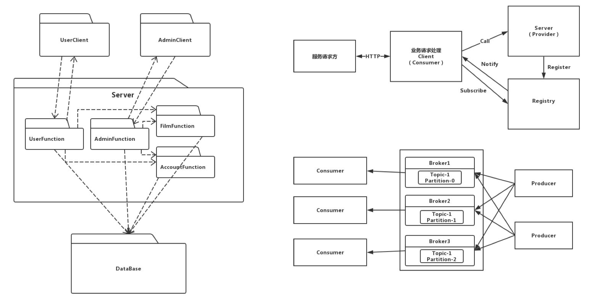

# 电影评分系统——项目文档

 

## 小组成员

| 姓名   | 学号      |
| ------ | --------- |
| 陈骁   | 161250014 |
| 吉宇哲 | 161250047 |
| 赖健明 | 161250051 |
| 连远翔 | 161250065 |
| 何天⾏ | 161250039 |
| 胡本霖 | 161250042 |
| 乐盛捷 | 161250053 |
| 雷诚   | 161250054 |

 

 

## 目录

[TOC]

 

 

 

## I.候选架构

### 1.1 分布式微服务架构

分布式系统具有更⾼的可延展性，当单个硬件的能⼒达到瓶颈时，通过增加数量来提⾼系统整体的性能。采⽤分布式系统可以在架构上对未来的⽤户增⻓长和数据增⻓长作好准备。卖票功能与地理位置关系密切，分布式系统可以根据⽤户所在地理位置，选择较近的结点作出反应，从⽽减少延迟，提升⽤户体验。此外，分布式系统的容错性，当某结点的出现意外，其他结点仍然可以正常运⾏，提⾼系统的可⽤性。

 

 

### 1.2 CS架构

Client-Server架构将系统拆分为服务端和客户端，客户端⽆须关⼼服务端的内部实现，仅通过⽹络调⽤服务器提供接⼝即可，这降低了客户端和服务端之间的耦合，同时隐藏了数据的储存策略，另外服务端和客户端可採⽤两种的硬件设备，对于计算要求较⾼的服务端，则可以採⽤⾼性能的硬件设备，客户端则不需，从⽽降低成本。服务器和客户端之间的职责明确清晰，这使得服务端和客户端可同时开发，降低开发的时间成本。

 

 

 

## II. 项目需求信息

### 2.1 项目的功能需求

- ⽤户购票：⽤户可以在平台上选择影院或电影查看上映，然后对电影进⾏选票的操作
- 发表评论：⽤户可以在观影完成后对电影进⾏评分和评论操作。
- 回复评论：⽤户可以看到其他⽤户的评分和评论，并可以对其他⽤户的评论进⾏评论、或者“顶/踩”操作。
- 账户管理：⽤户可以设置个⼈信息，包括昵称、⼿机号、密码、感兴趣电影类型等信息
- 订单管理：⽤户可以对已经购买的电影订单进⾏查看、退票、改签等操作。
- 报表查看：管理员可以查看每部电影的销售情况或者每个影院每次放映的的上座率，⽤户画像等资料
- 电影管理：管理员可以对电影进⾏上架、排⽚和下架操作。

 

 

### 2.2 应用场景

获得样本输入，筛选掉不必要的需求，列出 ASR：

#### Scenario 1：\>100的用户同时购买同一场电影的票（可靠性reliability、性能performance；高高）

| 场景组成部分 | 可能的值                                                     |
| ------------ | ------------------------------------------------------------ |
| 源           | 系统用户                                                     |
| 刺激         | \>100的用户同时购买同一场电影的票                            |
| 制品         | 系统的负载均衡模块、业务模块和数据库系统                     |
| 环境         | 系统正常运行                                                 |
| 响应         | 系统帮助用户正常完成购买操作 服务器端的数据库中的数据正常修改 客户端用户界面及时刷新 |
| 响应度量     | 98%以上的用户请求可以正常完成 90%以上的用户请求在1s内完成 |

 

#### Scenario 2：用户进行正确操作（易用性usability；高中）

| 场景组成部分 | 可能的值                                                     |
| ------------ | ------------------------------------------------------------ |
| 源           | 系统用户                                                     |
| 刺激         | 用户执行正常操作                                             |
| 制品         | 系统的客户端和服务器端                                       |
| 环境         | 系统正常运行                                                 |
| 响应         | 用户的操作得到期望的反馈 软件的操作简单易学、可以快速掌握 |
| 响应度量     | 90%以上的用户可以在30min内熟练使用本系统 98%以上的用户可以正确使用本系统完成任务 |

 

#### Scenario 3：用户进行错误操作（鲁棒性robustness；高高）

| 场景组成部分 | 可能的值                                                     |
| ------------ | ------------------------------------------------------------ |
| 源           | 系统用户                                                     |
| 刺激         | 用户执行错误操作                                             |
| 制品         | 系统的客户端的错误处理模块                                   |
| 环境         | 系统正常运行                                                 |
| 响应         | 用户的操作被拒绝 系统提示错误信息 系统告知用户可能的解决办法 |
| 响应度量     | 系统在2s内确认错误操作，并给用户错误提示信息                 |

 

#### Scenario 4：客户端迁移到其他系统或环境（可移植性Portability；低中）

| 场景组成部分 | 可能的值                                                     |
| ------------ | ------------------------------------------------------------ |
| 源           | 开发人员、维护人员                                           |
| 刺激         | 客户端或者服务端迁移到新的环境                               |
| 制品         | 客户端、服务端                                               |
| 环境         | 系统开发环境、或者系统维护和配置时                           |
| 响应         | 系统成功部署到运行环境 系统完成修改并通过所有测试        |
| 响应度量     | 完成部署和移植的代价为1个人月 移植成本占总成本的比例不得高于5% |

 

#### Scenario 5：为系统加入新的功能和服务（可扩展性Extensibility、可维护性Maintainability；高高）

| 场景组成部分 | 可能的值                                                     |
| ------------ | ------------------------------------------------------------ |
| 源           | 系统开发人员                                                 |
| 刺激         | 系统需要加入新的功能                                         |
| 制品         | 新添加的业务模块                                             |
| 环境         | 系统运行环境，系统正常运行                                   |
| 响应         | 新的功能成功部署 客户端正常更新                          |
| 响应度量     | 系统的发布不会影响99%以上用户的正常使用 添加系统功能时服务器维护时间在2小时以内 |

 

#### Scenario 6：数据库崩溃（可用性avibility、安全性Security；中中）

| 场景组成部分 | 可能的值                                                     |
| ------------ | ------------------------------------------------------------ |
| 源           | 系统开发人员、系统维护人员                                   |
| 刺激         | 数据库无法提供正常服务                                       |
| 制品         | 数据库系统、错误处理模块                                     |
| 环境         | 系统运行环境，系统正常运行；或者系统整体测试时               |
| 响应         | 尽快恢复数据库的正常功能 根据日志等记录信息定位崩溃原因  |
| 响应度量     | 在1h内使数据库恢复到可以正常工作的状态 在3个人日内查明并修复造成崩溃的原因 |

 

#### Scenario 7：增加新的硬件设施（可伸缩性scability；低低）

| 场景组成部分 | 可能的值                                           |
| ------------ | -------------------------------------------------- |
| 源           | 系统开发人员、系统维护人员                         |
| 刺激         | 服务器端需要增加新的硬件设施                       |
| 制品         | 机房硬件                                           |
| 环境         | 系统运行环境，系统正常运行                         |
| 响应         | 系统的正常运行和功能不受影响                       |
| 响应度量     | 在2h内完成系统的维护 98%的用户访问不会受到影响 |

 

#### Scenario 8：修改系统已有的功能（可修改性Modifibility；高中）

| 场景组成部分 | 可能的值                                                 |
| ------------ | -------------------------------------------------------- |
| 源           | 系统开发人员                                             |
| 刺激         | 服务器端的代码需要重新部署                               |
| 制品         | 服务器端业务模块                                         |
| 环境         | 系统运行环境，系统正常运行                               |
| 响应         | 系统的正常运行和功能不受影响                             |
| 响应度量     | 在2h内完成功能的修改和部署 98%的用户访问不会受到影响 |

 

#### Scenario 9：系统服务器无法正常运行（可用性availability；高中）

| 场景组成部分 | 可能的值                                                     |
| ------------ | ------------------------------------------------------------ |
| 源           | 系统服务器                                                   |
| 刺激         | 系统服务器崩溃，无法提供服务                                 |
| 制品         | 服务器端业务模块                                             |
| 环境         | 系统服务器出现故障，无法正常运行                             |
| 响应         | 查明服务器故障原因，修复系统故障 记录并保存故障日志 通知访问的用户相应的功能暂时无法使用 解决问题并重启服务器 |
| 响应度量     | 在3h内查明并修复故障 保证服务器在99%以上的运行时间内正常工作 |

 

#### Scenario 10：未登录的用户进行购票操作（安全性security；高中）

| 场景组成部分 | 可能的值                                                     |
| ------------ | ------------------------------------------------------------ |
| 源           | 未经授权的个人或者其他系统用户                               |
| 刺激         | 进行购票和支付操作                                           |
| 制品         | 系统的用户管理模块                                           |
| 环境         | 系统正常运行，但是用户没有登录                               |
| 响应         | 系统拒绝用户进行相应操作，并提示用户进行登录                 |
| 响应度量     | 在2s内拒绝未登录的用户进行操作 在拒绝请求之后记录相应的日志 |

 

#### Scenario 11：系统出现功能缺陷（可测试性testability；中中）

| 场景组成部分 | 可能的值                                                     |
| ------------ | ------------------------------------------------------------ |
| 源           | 开发者                                                       |
| 刺激         | 开发者发现系统存在BUG                                        |
| 制品         | 修复BUG的系统                                                |
| 环境         | 系统开发过程中，或者系统正常运行，                           |
| 响应         | 通过测试定位出现BUG的代码块 修改系统BUG，并测试修改后的代码 部署新的代码并重新启动系统 |
| 响应度量     | 在1h内定位出现BUG的代码块 在6h内修复系统BUG并通过测试 在2h内完成新代码的部署工作 |

 

#### Scenario 12：用户网络不稳定或失去连接（可用性availability；中高）

| 场景组成部分 | 可能的值                                                     |
| ------------ | ------------------------------------------------------------ |
| 源           | 用户所处的网络环境                                           |
| 刺激         | 网络不稳定或失去连接                                         |
| 制品         | 用户进行的操作                                               |
| 环境         | 客户端软件在无网络或网络不稳定的环境下运行                   |
| 响应         | 保存用户的操作和相应的信息 及时告知用户网络存在问题 等到网络状况良好时重新进行操作 |
| 响应度量     | 用户的操作和信息在0.5s内保存 在1s内告知用户相应的问题 检测到网络连接状况良好时，在1s内重新进行操作 |

 

 

 

# III. 对分布式微服务架构应用ADD

### 3.1 迭代一

#### 3.1.1 需求信息

参见「II. 项目需求信息」

 

#### 3.1.2 分解的系统组件

本次迭代进行整体架构设计，没有要分解的组件

 

#### 3.1.3 架构视图

 

 

### 3.3 迭代三

#### 3.3.1 需求信息

参见「II. 项目需求信息」

 

#### 3.3.2 分解的系统组件

选择注册集群进行分析、设计和分解，该组件负责服务集群中服务的分发，是保证系统负载均衡以及服务稳定、可靠、性能良好的关键，此组件在系统中起到至关重要的作用。

 

#### 3.3.3 组件负责的ASR

| 架构驱动                                | 重要性 | 难易度 |
| --------------------------------------- | ------ | ------ |
| 场景1：\>100的用户同时购买同一场电影的票 | 高     | 高     |
| 场景2：用户进行正确操作                 | 高     | 中     |
| 场景5：为系统加入新的功能和服务         | 高     | 高     |
| 场景8：修改系统已有的功能               | 高     | 中     |
| 场景9：系统服务器无法正常运行           | 高     | 中     |

 

#### 3.3.4 为ASR进行设计

1. **设计关注点**

| 质量属性 | 设计关注点 | 子关注点 |
| ------ | --------- | ------ |
| 性能、可用性 | 服务分发能力 | 服务分发的负载均衡 |
| 可靠性 | 服务更新能力 | 注册节点的同步能力 |
| 易用性、可维护性 | 服务节点的架构 | 服务节点的通信 |
| 可扩展性、可修改性 | 修改服务节点对系统的影响 | 服务注册表的构建能力 服务节点的部署能力 |

2. **关注点的候选模式**

   - **服务分发的负载均衡**

     | # | 候选模式名称 | 处理性能 | 资源开销 | 开发成本 |
     | --|--------- | ------ | ------ | --|
     | 1 | 使用F5或Array硬件处理请求分发 | 高 | 高 | 低 |
     | 2 | 使用Ngnix等软件处理请求分发 | 中 | 低 | 低 |
     | 3 | 在客户端存储和维护服务端清单 | 中 | 低 | 中 |

     - **选择的模式及理由**

       使用硬件处理分发请求虽然效率更高，但与快速迭代和部署的现实要求有所冲突；使用Ngnix等软件处理请求分发，可以进行快速的迭代和修改，同时可以很方便地修改配置，同时在正常流量下可以保证与硬件分发相差不大的性能提升。

       但是无论哪种方法，都会在数据量集中访问的情况下出现单点的性能瓶颈问题，可以通过在客户端存储和维护服务端清单来减少客户端对负载均衡节点的访问，提升效率。

       最后选择的模式为“使用Ngnix等软件处理请求分发”和“在客户端存储和维护服务端清单”。

   - **注册节点的同步能力**

     | # | 候选模式名称 | CAP | 服务健康检查 |
     | --|--------- | ------ | ------ |
     | 1 | Server/Client模式 | AP | 可配支持 |
     | 2 | Gossip协议 | CP | 支持 |
     | 3 | Zab协议栈模式 | CP | 支持 |

     - **选择的模式及理由**

       CAP原则，指的是在一个分布式系统中，Consistency(一致性，各数据备份处于同一状态)、Availability(可用性，系统中的一部分节点宕机后，系统能相应用户请求)、Partition Tolerance(分区容错性，系统能容忍网络区间通信出现失败)，不能同时成立。

       Server/Client模式为了保证高可用，在一致性方面做了妥协；而Gossip协议虽然达到了高可靠却不能保证高可用性。Zab协议栈模式在两者之前做课相应的妥协。鉴于本系统对于一致性和可用性都没有特别高的性能追求，最终选择Zab协议栈模式。

   - **服务节点的通信**

     | # | 候选模式名称 | 复杂度 | 成本 |
     | --|--------- | ------ | ------ |
     | 1 | Restful API | 低 | 低 |
     | 2 | 消息队列 | 中 | 低 |

     - **选择的模式及理由**

       注册集群内的组件，每个服务运行在其独立的进程中，服务和服务之间采用轻量级的通新机制进行互相沟通。

       使用基于HTTP的Restful API，相较于消息队列机制，能够更方便地提供复杂数据结构的编码和传输，同时因为注册集群需要和其他各个集群进行较为频繁的交流，使用HTTP协议可以保证数据传送完成后关闭协议，网络资源的释放和管理更加灵活方便。因此选用Restful API。

   - **服务注册表的构建能力**

     | # | 候选模式名称 | 速度 | 成本 | 可靠性 |
     | --|--------- | ------ | ------ | --|
     | 1    | 业务服务器更新时更新注册中心   | 快   | 高   | 低     |
     | 2    | 注册中心定时检查业务服务器状态 | 满   | 中   | 中     |
     | 3    | 业务服务器定时更新注册表       | 快   | 高   | 高     |

     - **选择的模式及理由**

       通过只在业务服务器更新时更新注册中心，可以有效减少网络请求的次数，但是在业务服务器宕机等意外情况下，注册中心并不能及时获取业务服务器的状态。

       在注册中心和业务服务器定时发送信息的情况下，考虑到快速迭代的需求，需要使得新加入的服务器能够第一时间进行业务协作。考虑到这一点，可以选择模式3，有业务服务器实现注册中心的接口，定时更新注册表，同时由于注册中心不必发出多个网络请求，降低了负载，减少注册中心宕机的可能性。

   - **服务节点的部署能力**

     | # | 候选模式名称 | 速度 | 成本 | 可用性 |
     | --|--------- | ------ | ------ | --|
     | 1 | 修改注册中心并重新部署 | 满 | 高 | 低 |
     | 2 | Zab协议栈模式 | 快 | 低 | 中 |

     - **选择的模式及理由**

       修改注册中心并重新部署，系统的维护时间较长，在一些需要快速迭代的场合可能会导致业务上的停摆，同时重新部署可能带来的运行时故障也需要被考虑。

       Zab协议栈基于Paxos算法，它使用了单一的Leader来接受和处理客户端的所有事务请求，并将服务器数据的状态变更以事务Proposal的形式广播到所有的Server中。Zab协议利用崩溃恢复和消息广播两种基本模式提供了相当水平的可用性，新出册的节点在加入后等待，带到下一轮Leader选举时自动进入Follower群组。所以选择Zab协议栈。

3. **候选模式与对应ASR**

| 模式类型             | 选择的模式            | 架构驱动     |
| -------------------- | ------------------- | ------------ |
| 服务分发的负载均衡   | 使用Ngnix等软件处理请求分发 在客户端存储和维护服务端清单 | 场景1、场景9 |
| 注册节点的同步能力   | Zab协议栈模式              | 场景1        |
| 服务节点的通信       | Restful API               | 场景2、场景5 |
| 服务注册表的构建能力 | 业务服务器定时更新注册表     | 场景5、场景8 |
| 服务节点的部署能力   | Zab协议栈模式               | 场景5、场景8 |

 

#### 3.3.5 架构视图

1. **C&C视图**

2. **Module视图**

 

#### 3.3.6 评估

本次设计使用ADD方法对服务注册集群模块进行分解、细化，在考虑各质量属性的同时，兼顾了系统的实际成本（数据库存储），并在系统性能、可伸缩性、可移植性、可靠性及可用性之间做了权衡，较好的兼顾了上述各质量属性。

 

 

### 3.4 迭代四

#### 3.4.1 需求信息

参见「II. 项目需求信息」

 

#### 3.4.2 分解的系统组件

选择通信机制组件进行分解，该组件负责API网关、服务集群和注册集群之间网络的传输，需要保证快速、稳定以及高并发的请求和获取服务。

 

#### 3.4.3 组件负责的ASR

| 架构驱动                                 | 重要性 | 难易度 |
| ---------------------------------------- | ------ | ------ |
| 场景1：\>100的用户同时购买同一场电影的票 | 高     | 高     |
| 场景10：未登录的用户进行购票操作         | 高     | 中     |
| 场景12：用户网络不稳定或失去连接         | 中     | 高     |

 

#### 3.4.4 为ASR进行设计

1. **设计关注点**

| 质量属性 | 设计关注点     | 子关注点       |
| -------- | -------------- | -------------- |
| 性能     | 控制资源请求   | 设置任务优先级 |
| 可用性   | 检测连接状态   | 检测通信有效性 |
| 可靠性   | 保证数据完整性 | 数据校验       |
| 安全性   | 网络传输安全   | 信息加密       |

2. **关注点的候选模式**

   - **设置任务优先级**

   | #    | 模式名称             | 性能 | 实时性 | 是否数据丢失 |
   | ---- | -------------------- | ---- | ------ | ------------ |
   | 1    | 使用优先队列处理请求 | 中   | 中     | 否           |
   | 2    | 使用队列处理请求     | 高   | 低     | 否           |
   | 3    | 忽略低优先级请求     | 高   | 高     | 是           |

   - **选择的模式及理由**

     选择使用优先队列来处理信息，这样可以在保证数据不会丢失的情况下仍然可以先处理高优先级的请求。虽然使用队列不会有进行排序的开销，但这样就难以对信息进行控制，不能确保最紧急的请求最优先被处理。同时，虽然忽略低优先级请求具有高效的性能，但其存在数据丢失。因此，优先队列是合理的选择。

   - **检测通信有效性**

     | #    | 模式名称  | 网络负担 | 实现难度 |
     | ---- | --------- | -------- | -------- |
     | 1    | 心跳检测  | 中       | 中       |
     | 2    | Ping/Echo | 高       | 高       |

     - **选择的模式及理由**

       选择使用心跳检测。因为实现心跳检测比实现Ping/Echo要高。同时，完成一次心跳检测只需要发送一次信息，而完成一次Ping/Echo需要发送两次信息，如果使用Ping/Echo则会加大对通信负担。

   - **数据校验**

     | #    | 模式名称     | 正确率 | 实现难度 |
     | ---- | ------------ | ------ | -------- |
     | 1    | 奇偶校验     | 中     | 低       |
     | 2    | 循环冗余校验 | 高     | 高       |

     - **选择的模式及理由**

       选择使用奇偶校验。循环冗余校验之所以能带来高准确率是因为它有更多的校验位，这会增加链路负担，而且对网络传输的数据也只需要进行基本的校验，循环冗余校验的高准确率超过了系统的需要。因此在能满足数据可靠性的情况下，成本较低的奇偶校验是更优的选择。

   - **信息加密**

     | #    | 模式名称            | 性能 | 安全性 | 实现难度 |
     | ---- | ------------------- | ---- | ------ | -------- |
     | 1    | 使用SSL/TSL进行加密 | 高   | 高     | 低       |
     | 2    | 使用AES认证机制     | 中   | 高     | 高       |

     - **选择的模式及理由**

       选择使用SSL/TSL进行加密。因为SSL/TLS被广泛用于数据加密中。不仅如此，SSL/TLS被大多数设备所支持，并且实现该机制的成本更低。

4. **候选模式与对应ASR**

| 模式类型       | 选择的模式           | 架构驱动 |
| -------------- | -------------------- | -------- |
| 设置任务优先级 | 使用优先队列处理请求 | 场景1    |
| 检测通信有效性 | 心跳检测             | 场景12   |
| 数据校验       | 奇偶校验             | 场景1    |
| 信息加密       | 使用SSL/TSL进行加密  | 场景10   |

 

#### 3.4.5 架构视图

1. **C&C视图**

2. **Module视图**

 

#### 3.4.6 评估

本次设计使用ADD方法对通信机制模块进行分解、细化，在考虑各质量属性的同时，兼顾了系统的实际成本（数据库存储），并在系统性能、可伸缩性、可移植性、可靠性及可用性之间做了权衡，较好的兼顾了上述各质量属性。

 

 

### 3.5 迭代五

#### 3.5.1 需求信息

参见「II. 项目需求信息」

 

#### 3.5.2 分解的系统组件

在这轮迭代中选择API网关组件进行分解。API网关接受来自用户浏览器的HTTP请求，然后通过远程过程调用(RPC Remote Procedure Calls)将请求转发到服务集群中，对于整个系统而言API网关组件至关重要。

 

#### 3.5.3 组件负责的ASRs

| 架构驱动                                | 重要性   | 难易度   |
| --------------------------------------- | -------- | -------- |
| 场景1：\>100的用户同时购买同一场电影的票 | 高 | 高 |
| 场景2：用户进行正常操作       | 高 | 中 |
| 场景3：用户进行错误操作       | 高 | 高 |
| 场景9：系统服务器无法正常运行  | 高 | 中 |
| 场景10：未登录的用户进行购票操作 | 高 | 中 |
| 场景12：用户网络不稳定或失去连接 | 中 | 高 |

 

#### 3.5.4 为ASR进行设计

1. **设计关注点**

| 质量属性 | 设计关注点 | 子关注点 |
| ------ | --------- | ------ |
|  可用性(Availability) | 故障恢复机制 | 对不可用服务的发现 |
|  可用性(Availability) | 故障恢复机制 | 对不可用服务的解决 |
|  可用性(Availability) | 对服务的发现和监控 | 保持和服务注册模块的连通 |
|  性能(Performance) | 服务的负载均衡 | 负载均衡模式 |
|  性能(Performance) | 缓存 | 缓存机制 |
|  安全性(Security)  | 有效抵御攻击 | 设置访问权限，身份认证，访问控制 |

2. **关注点的候选模式**

   - **对不可用服务的发现**

     | 模式编号 | 模式 | 可用性 | 响应时间 |
     | --- | ------ | --------- | ------ |
     | 1 | 如果一定量的请求都失败了，说明服务是不可用的 | H | M |
     | 2 | 如果在一定时间内没有成功的请求，说明服务是不可用的 | H | L |
     | 3 | 定时发送Ping请求，如果没有得到Echo，说明服务是不可用的 | H | H |

     - **选择的模式及理由**
     
       选择第一种模式，因为现实生活中不能预测服务到来的频率，如果采用第二种模式，可能会造成服务可用性的误判，而使用第三种方法会造成系统额外的开销，会对性能有一定的影响。

   - **对不可用服务的解决**
   
     | 模式编号 | 模式 | 可用性 | 响应时间 |
     | --- | ------ | --------- | ------ |
     | 1 | 直接返回已经在缓存的结果或者返回错误消息 | H | L |
     | 2 | 直到服务可用前不停尝试重新请求 | L | H |
     | 3 | 在尝试一定次数没有效果时返回缓存的结果或者返回错误信息 | H | M |

     - **选择的模式及理由**
   
       选择第三种模式；第三种模式有较高的可用性且响应时间适中，如果采用第一种模式虽然响应时间比较短，但是对于短暂的不可用服务容易直接返回错误信息降低用户的使用满意度；第二种模式对于长时间的不可用服务容易造成用户等待很久的问题，会提高用户的等待时间。

   - **保持和服务注册模块的连通**
   
     | 模式编号 | 模式 | 可用性 | 花费和成本 |
     | --- | ------ | --------- | ------ |
     | 1 | 使用heartbeat方式和服务注册模块保持联系 | H | H |
     | 2 | 在请求到来的时候对服务注册模块进行Ping操作 | M | M |

     - **选择的模式及理由**
   
       选择第一种模式，因为第一种模式能够保证较高的可用性，虽然花费比较高，但是由于保持和服务注册模块的连通是对系统至关重要的，所以值得花费成本来保障；而第二种方法有可能降低响应用户请求的效率。

   - **负载均衡模式**
   
     | 模式编号 | 模式 | 可用性 | 花费和成本 |
     | --- | ------ | --------- | ------ |
     | 1 | 加权循环调度算法 | M | M |
     | 2 | 最小连接数算法 | H | M |
     | 3 | 源地址哈希算法 | M | L |
     | 4 | 随机算法 | L | L |

     - **选择的模式及理由**
   
       选择第二种模式，最小连接数算法是以后端服务器的视角来观察系统的负载，比较灵活和智能，算法效果较好，极大的提高后端服务器的利用效率，将负载合理地分流到每一台机器。

   - **缓存机制**
   
     | 模式编号 | 模式 | 可用性 | 性能 | 花费和成本 |
     | --- | ------ | ---- | ----- | ------ |
     | 1 | 主动刷新缓存 | H | H | M |
     | 2 | 被动刷新缓存 | H | M | H |

     - **选择的模式及理由**
   
       选择主动刷新的缓存，在获得客户端的请求时，先去缓存表中查找，如果找到了服务地址，进行可用性检查后返回给客户机，如果没有找到，则再向客户机中寻找，找到后更新维护缓存表，而如果使用被动刷新缓存，则服务地址发生改变后就要通知更新缓存，通信时间较长从而影响性能。

   - **设置访问权限，身份认证，访问控制**
   
     | 模式编号 | 模式 | 可用性 | 花费和成本 |
     | --- | ------ | ---- | ----- | ------ |
     | 1 | 记录已有的攻击并通过和已有攻击进行比较鉴别出新的攻击 | H | H |
     | 2 | 对能供访问并修改系统数据的人员进行授权和鉴定 | H | M |
     | 3 | 当收到攻击时，要收回对敏感资源的访问权限 | H | M |

     - **选择的模式及理由**
   
       采用第二种和第三种模式的组合，对访问系统数据的人员进行身份认证能够极大的保护系统的安全性同时不会花费太多成本，而在受到攻击时，要能够迅速的对敏感资源进行保护，收回访问权限，从而保护系统的安全性。

3. **候选模式与对应ASR**

| 模式类型     | 选择的模式         | 架构驱动      |
| ------------ | ------------------ | ------------- |
| 对不可用服务的发现 | 如果一定量的请求都失败了，说明服务是不可用的 | 场景1、场景9 |
| 对不可用服务的解决 | 在尝试一定次数没有效果时返回缓存的结果或者返回错误信息 | 场景1、场景9 |
| 保持和服务注册模块的连通 | 使用heartbeat方式和服务注册模块保持联系 | 场景2、场景9 |
| 负载均衡模式 | 最小连接数算法 | 场景1 |
| 缓存机制 | 主动刷新缓存 | 场景1、场景2 |
| 设置访问权限，身份认证，访问控制 | 对能供访问并修改系统数据的人员进行授权和鉴定&&当收到攻击时，要收回对敏感资源的访问权限 | 场景3、场景10、场景12 |

 

#### 3.5.5 架构视图

1. **C&C视图**

2. **Module视图**

 

#### 3.5.6 评估

本次设计使用ADD方法对API网关模块进行分解、细化，在考虑各质量属性的同时，兼顾了系统的实际成本（数据库存储），并在系统性能、可伸缩性、可移植性、可靠性及可用性之间做了权衡，较好的兼顾了上述各质量属性。

 

 

### 3.6 迭代六

#### 3.6.1 需求信息

参见「II. 项目需求信息」
 

#### 3.6.2 分解的系统组件

选择系统的数据存储模块进行分解，数据存储模块主要承担职责如下：

- 存储用户信息、电影信息、评论信息、订单信息、交易数据等
- 存储电影海报、用户头像、电影PV等静态资源
- 对外提供统一访问接口
- 内部监控各存储单元（主机）的工作情况

 

#### 3.6.3 组件负责的ASRs

| 架构驱动                                | 重要性 | 难易度 |
| --------------------------------------- | ------ | ------ |
| 场景1：>100的用户同时购买同一场电影的票 | 高     | 高     |
| 场景6：数据库崩溃                       | 高     | 高     |

 

#### 3.6.4 为ASR进行设计

1. **设计关注点**

静态资源：电影海报、用户头像、电影PV
存储单元：存储数据的主机

| 质量属性 | 设计关注点   | 子关注点                           |
| -------- | ------------ | ---------------------------------- |
| 可靠性   | 数据备份     | 数据库备份 文件系统备份        |
| 性能     | 静态资源存储 | 图片存储 文字存储 视频存储 |
| 可移植性 | 对外接口实现 | 数据库操作                         |
| 可用性   | 错误处理     | 数据库宕机                         |

2. **关注点的候选模式**

   - **数据库备份**

     | #    | 模式名称         | 时间开销 | 资源开销 | 成功概率 |
     | ---- | ---------------- | -------- | -------- | -------- |
     | 1    | 实时备份         | 高       | 高       | 高       |
     | 2    | 固定时间间隔备份 | 中       | 中       | 中       |

     - **选择的模式及理由**

       选择实时备份。为了保证系统的可靠性，需要对数据库中的业务数据进行备份，以防数据库崩溃造成无法挽回的损失。由于业务数据直接关系到用户的财产安全，所以选择实时备份模式，虽然相对会消耗更多资源，但是用户的安全始终是第一位的。

   - **文件系统备份**

     | #    | 模式名称         | 时间开销 | 资源开销 | 成功概率 |
     | ---- | ---------------- | -------- | -------- | -------- |
     | 1    | 实时备份         | 高       | 高       | 高       |
     | 2    | 固定时间间隔备份 | 中       | 中       | 中       |

     - **选择的模式及理由**

       选择固定时间间隔备份。相对业务数据而言，访问静态资源所需的系统开销更大，但重要性较低。若采用实时备份，将会造成大量的不必要的系统开销。另一方面，即使文件系统崩溃，大多数情况下也可以通过磁盘恢复得到原有数据。

   - **图片存储**

     | #    | 模式名称       | 时间开销 | 资源开销 | 成本 |
     | ---- | -------------- | -------- | -------- | ---- |
     | 1    | 文件系统存储   | 中       | 低       | 低   |
     | 2    | 图形数据库存储 | 低       | 中       | 高   |

     - **选择的模式及理由**

       选择文件系统存储。相较于极其稳定和成熟的文件系统存储技术，图形数据库技术尚不成熟，无法保证高可用和稳定性。系统需要存储大量电影图片海报等，所以采用文件系统数据库能够存储更多图片。

   - **大段文本存储**

     | #    | 模式名称     | 时间开销 | 资源开销 | 成本 |
     | ---- | ------------ | -------- | -------- | ---- |
     | 1    | 文件系统存储 | 中       | 低       | 低   |
     | 2    | 数据库存储   | 低       | 中       | 高   |

     - **选择的模式及理由**

       选择文件系统存储。大段文本若存储在数据库中，因为各字段长短不一，会造成极大的资源浪费，同时会降低数据库访问性能，而使用文件系统存储则不会出现类似问题。

   - **视频存储**

     | #    | 模式名称     | 时间开销 | 资源开销 | 成本 |
     | ---- | ------------ | -------- | -------- | ---- |
     | 1    | 文件系统存储 | 中       | 低       | 低   |
     | 2    | 数据库存储   | 低       | 中       | 高   |

     - **选择的模式及理由**

       选择文件系统存储。视频文件过大，而且没有合适的数据库可以存储视频文件。

   - **数据库操作**

     | #    | 模式名称    | 时间开销 | 资源开销 | 启动时间开销 |
     | ---- | ----------- | -------- | -------- | ------------ |
     | 1    | 静态sql语句 | 低       | 低       | 低           |
     | 2    | 动态生成sql | 低       | 中       | 高           |

     - **选择的模式及理由**

       动态生成sql。数据库迁移时，静态的sql语言需要重写，开销较大，又因为数据库不需要频繁启动，所以启动成本可以不考虑在内。

   - **数据库宕机**

     | #    | 模式名称         | 时间开销 | 资源开销 | 监控即时性 |
     | ---- | ---------------- | -------- | -------- | ---------- |
     | 1    | 固定时间间隔监控 | 低       | 低       | 低         |
     | 2    | 请求无响应时报错 | 中       | 中       | 中         |
     | 2    | 实时监控         | 高       | 高       | 高         |

     - **选择的模式及理由**

       固定时间间隔监控。实时监控的成本巨大，然而当请求无响应时报错，故障实时排除的难度较大，所以选用固定时间间隔监控。

3. **候选模式与对应ASR**

| 模式类型     | 选择的模式       | 架构驱动 |
| ------------ | ---------------- | -------- |
| 数据库备份   | 数据备份         | 场景6    |
| 文件系统备份 | 固定时间间隔备份 | 场景6    |
| 图片存储     | 文件系统存储     | 场景1    |
| 大段文本存储 | 文件系统存储     | 场景1    |
| 视频存储     | 文件系统存储     | 场景1    |
| 数据库操作   | 动态生成sql      | 场景1    |
| 数据库宕机   | 固定时间间隔监控 | 场景6    |

 

#### 3.6.5 架构视图

1. **C&C视图**

2. **Module视图**

 

#### 3.6.6 评估

本次设计使用ADD方法对数据存储模块进行分解、细化，在考虑各质量属性的同时，兼顾了系统的实际成本（数据库存储），并在系统性能、可伸缩性、可移植性、可靠性及可用性之间做了权衡，较好的兼顾了上述各质量属性。

