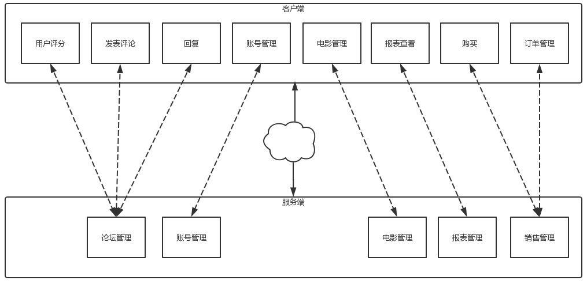
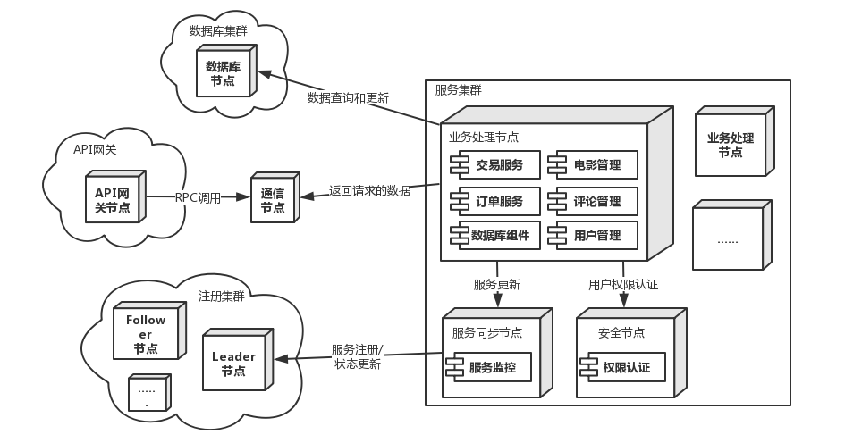
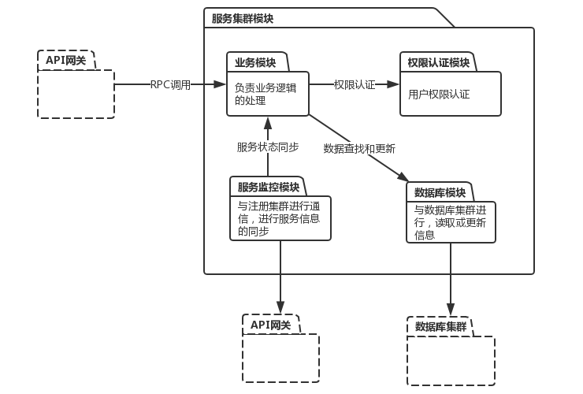

# 电影评分系统——项目文档

 

## 小组成员

| 姓名   | 学号      |
| ------ | --------- |
| 陈骁   | 161250014 |
| 吉宇哲 | 161250047 |
| 赖健明 | 161250051 |
| 连远翔 | 161250065 |
| 何天⾏ | 161250039 |
| 胡本霖 | 161250042 |
| 乐盛捷 | 161250053 |
| 雷诚   | 161250054 |

 

 

## 目录

[TOC]

 

 

 

## I.候选架构

### 1.1 分布式微服务架构

分布式系统具有更⾼的可延展性，当单个硬件的能⼒达到瓶颈时，通过增加数量来提⾼系统整体的性能。采⽤分布式系统可以在架构上对未来的⽤户增⻓长和数据增⻓长作好准备。卖票功能与地理位置关系密切，分布式系统可以根据⽤户所在地理位置，选择较近的结点作出反应，从⽽减少延迟，提升⽤户体验。此外，分布式系统的容错性，当某结点的出现意外，其他结点仍然可以正常运⾏，提⾼系统的可⽤性。

 

 

### 1.2 CS架构

Client-Server架构将系统拆分为服务端和客户端，客户端⽆须关⼼服务端的内部实现，仅通过⽹络调⽤服务器提供接⼝即可，这降低了客户端和服务端之间的耦合，同时隐藏了数据的储存策略，另外服务端和客户端可採⽤两种的硬件设备，对于计算要求较⾼的服务端，则可以採⽤⾼性能的硬件设备，客户端则不需，从⽽降低成本。服务器和客户端之间的职责明确清晰，这使得服务端和客户端可同时开发，降低开发的时间成本。

 

 

 

## II. 项目需求信息

### 2.1 项目的功能需求

- ⽤户购票：⽤户可以在平台上选择影院或电影查看上映，然后对电影进⾏选票的操作
- 发表评论：⽤户可以在观影完成后对电影进⾏评分和评论操作。
- 回复评论：⽤户可以看到其他⽤户的评分和评论，并可以对其他⽤户的评论进⾏评论、或者“顶/踩”操作。
- 账户管理：⽤户可以设置个⼈信息，包括昵称、⼿机号、密码、感兴趣电影类型等信息
- 订单管理：⽤户可以对已经购买的电影订单进⾏查看、退票、改签等操作。
- 报表查看：管理员可以查看每部电影的销售情况或者每个影院每次放映的的上座率，⽤户画像等资料
- 电影管理：管理员可以对电影进⾏上架、排⽚和下架操作。

 

 

### 2.2 应用场景

获得样本输入，筛选掉不必要的需求，列出 ASR：

#### Scenario 1：\>100的用户同时购买同一场电影的票（可靠性reliability、性能performance；高高）

| 场景组成部分 | 可能的值                                                     |
| ------------ | ------------------------------------------------------------ |
| 源           | 系统用户                                                     |
| 刺激         | \>100的用户同时购买同一场电影的票                            |
| 制品         | 系统的负载均衡模块、业务模块和数据库系统                     |
| 环境         | 系统正常运行                                                 |
| 响应         | 系统帮助用户正常完成购买操作 服务器端的数据库中的数据正常修改 客户端用户界面及时刷新 |
| 响应度量     | 98%以上的用户请求可以正常完成 90%以上的用户请求在1s内完成 |

 

#### Scenario 2：用户进行正确操作（易用性usability；高中）

| 场景组成部分 | 可能的值                                                     |
| ------------ | ------------------------------------------------------------ |
| 源           | 系统用户                                                     |
| 刺激         | 用户执行正常操作                                             |
| 制品         | 系统的客户端和服务器端                                       |
| 环境         | 系统正常运行                                                 |
| 响应         | 用户的操作得到期望的反馈 软件的操作简单易学、可以快速掌握 |
| 响应度量     | 90%以上的用户可以在30min内熟练使用本系统 98%以上的用户可以正确使用本系统完成任务 |

 

#### Scenario 3：用户进行错误操作（鲁棒性robustness；高高）

| 场景组成部分 | 可能的值                                                     |
| ------------ | ------------------------------------------------------------ |
| 源           | 系统用户                                                     |
| 刺激         | 用户执行错误操作                                             |
| 制品         | 系统的客户端的错误处理模块                                   |
| 环境         | 系统正常运行                                                 |
| 响应         | 用户的操作被拒绝 系统提示错误信息 系统告知用户可能的解决办法 |
| 响应度量     | 系统在2s内确认错误操作，并给用户错误提示信息                 |

 

#### Scenario 4：客户端迁移到其他系统或环境（可移植性Portability；低中）

| 场景组成部分 | 可能的值                                                     |
| ------------ | ------------------------------------------------------------ |
| 源           | 开发人员、维护人员                                           |
| 刺激         | 客户端或者服务端迁移到新的环境                               |
| 制品         | 客户端、服务端                                               |
| 环境         | 系统开发环境、或者系统维护和配置时                           |
| 响应         | 系统成功部署到运行环境 系统完成修改并通过所有测试        |
| 响应度量     | 完成部署和移植的代价为1个人月 移植成本占总成本的比例不得高于5% |

 

#### Scenario 5：为系统加入新的功能和服务（可扩展性Extensibility、可维护性Maintainability；高高）

| 场景组成部分 | 可能的值                                                     |
| ------------ | ------------------------------------------------------------ |
| 源           | 系统开发人员                                                 |
| 刺激         | 系统需要加入新的功能                                         |
| 制品         | 新添加的业务模块                                             |
| 环境         | 系统运行环境，系统正常运行                                   |
| 响应         | 新的功能成功部署 客户端正常更新                          |
| 响应度量     | 系统的发布不会影响99%以上用户的正常使用 添加系统功能时服务器维护时间在2小时以内 |

 

#### Scenario 6：数据库崩溃（可用性avibility、安全性Security；中中）

| 场景组成部分 | 可能的值                                                     |
| ------------ | ------------------------------------------------------------ |
| 源           | 系统开发人员、系统维护人员                                   |
| 刺激         | 数据库无法提供正常服务                                       |
| 制品         | 数据库系统、错误处理模块                                     |
| 环境         | 系统运行环境，系统正常运行；或者系统整体测试时               |
| 响应         | 尽快恢复数据库的正常功能 根据日志等记录信息定位崩溃原因  |
| 响应度量     | 在1h内使数据库恢复到可以正常工作的状态 在3个人日内查明并修复造成崩溃的原因 |

 

#### Scenario 7：增加新的硬件设施（可伸缩性scability；低低）

| 场景组成部分 | 可能的值                                           |
| ------------ | -------------------------------------------------- |
| 源           | 系统开发人员、系统维护人员                         |
| 刺激         | 服务器端需要增加新的硬件设施                       |
| 制品         | 机房硬件                                           |
| 环境         | 系统运行环境，系统正常运行                         |
| 响应         | 系统的正常运行和功能不受影响                       |
| 响应度量     | 在2h内完成系统的维护 98%的用户访问不会受到影响 |

 

#### Scenario 8：修改系统已有的功能（可修改性Modifibility；高中）

| 场景组成部分 | 可能的值                                                 |
| ------------ | -------------------------------------------------------- |
| 源           | 系统开发人员                                             |
| 刺激         | 服务器端的代码需要重新部署                               |
| 制品         | 服务器端业务模块                                         |
| 环境         | 系统运行环境，系统正常运行                               |
| 响应         | 系统的正常运行和功能不受影响                             |
| 响应度量     | 在2h内完成功能的修改和部署 98%的用户访问不会受到影响 |

 

#### Scenario 9：系统服务器无法正常运行（可用性availability；高中）

| 场景组成部分 | 可能的值                                                     |
| ------------ | ------------------------------------------------------------ |
| 源           | 系统服务器                                                   |
| 刺激         | 系统服务器崩溃，无法提供服务                                 |
| 制品         | 服务器端业务模块                                             |
| 环境         | 系统服务器出现故障，无法正常运行                             |
| 响应         | 查明服务器故障原因，修复系统故障 记录并保存故障日志 通知访问的用户相应的功能暂时无法使用 解决问题并重启服务器 |
| 响应度量     | 在3h内查明并修复故障 保证服务器在99%以上的运行时间内正常工作 |

 

#### Scenario 10：未登录的用户进行购票操作（安全性security；高中）

| 场景组成部分 | 可能的值                                                     |
| ------------ | ------------------------------------------------------------ |
| 源           | 未经授权的个人或者其他系统用户                               |
| 刺激         | 进行购票和支付操作                                           |
| 制品         | 系统的用户管理模块                                           |
| 环境         | 系统正常运行，但是用户没有登录                               |
| 响应         | 系统拒绝用户进行相应操作，并提示用户进行登录                 |
| 响应度量     | 在2s内拒绝未登录的用户进行操作 在拒绝请求之后记录相应的日志 |

 

#### Scenario 11：系统出现功能缺陷（可测试性testability；中中）

| 场景组成部分 | 可能的值                                                     |
| ------------ | ------------------------------------------------------------ |
| 源           | 开发者                                                       |
| 刺激         | 开发者发现系统存在BUG                                        |
| 制品         | 修复BUG的系统                                                |
| 环境         | 系统开发过程中，或者系统正常运行，                           |
| 响应         | 通过测试定位出现BUG的代码块 修改系统BUG，并测试修改后的代码 部署新的代码并重新启动系统 |
| 响应度量     | 在1h内定位出现BUG的代码块 在6h内修复系统BUG并通过测试 在2h内完成新代码的部署工作 |

 

#### Scenario 12：用户网络不稳定或失去连接（可用性availability；中高）

| 场景组成部分 | 可能的值                                                     |
| ------------ | ------------------------------------------------------------ |
| 源           | 用户所处的网络环境                                           |
| 刺激         | 网络不稳定或失去连接                                         |
| 制品         | 用户进行的操作                                               |
| 环境         | 客户端软件在无网络或网络不稳定的环境下运行                   |
| 响应         | 保存用户的操作和相应的信息 及时告知用户网络存在问题 等到网络状况良好时重新进行操作 |
| 响应度量     | 用户的操作和信息在0.5s内保存 在1s内告知用户相应的问题 检测到网络连接状况良好时，在1s内重新进行操作 |

 

 

 

# III. 对分布式微服务架构应用ADD

### 3.1 迭代一

#### 3.1.1 需求信息

参见「II. 项目需求信息」

 

#### 3.1.2 分解的系统组件

本次迭代进行整体架构设计，没有要分解的组件

 

#### 3.1.3 架构视图

 

 

### 3.3 迭代三

#### 3.3.1 需求信息

参见「II. 项目需求信息」

 

#### 3.3.2 分解的系统组件

选择注册集群进行分析、设计和分解，该组件负责服务集群中服务的分发，是保证系统负载均衡以及服务稳定、可靠、性能良好的关键，此组件在系统中起到至关重要的作用。

 

#### 3.3.3 组件负责的ASR

| 架构驱动                                | 重要性 | 难易度 |
| --------------------------------------- | ------ | ------ |
| 场景1：>100的用户同时购买同一场电影的票 | 高     | 高     |
| 场景2：用户进行正确操作                 | 高     | 中     |
| 场景5：为系统加入新的功能和服务         | 高     | 高     |
| 场景8：修改系统已有的功能               | 高     | 中     |
| 场景9：系统服务器无法正常运行           | 高     | 中     |

 

#### 3.2.4 为ASR进行设计

1. **设计关注点**

| 质量属性 | 设计关注点 | 子关注点 |
| ------ | --------- | ------ |
| 性能、可用性 | 服务分发能力 | 服务分发的负载均衡 |
| 可靠性 | 服务更新能力 | 注册节点的同步能力 |
| 易用性、可维护性 | 服务节点的架构 | 服务节点的通信 |
| 可扩展性、可修改性 | 修改服务节点对系统的影响 | 服务注册表的构建能力 服务节点的部署能力 |

2. **关注点的候选模式**

   - **服务分发的负载均衡**

     | # | 候选模式名称 | 处理性能 | 资源开销 | 开发成本 |
     | --|--------- | ------ | ------ | --|
     | 1 | 使用F5或Array硬件处理请求分发 | 高 | 高 | 低 |
     | 2 | 使用Ngnix等软件处理请求分发 | 中 | 低 | 低 |
     | 3 | 在客户端存储和维护服务端清单 | 中 | 低 | 中 |

     - 选择的模式及理由

       使用硬件处理分发请求虽然效率更高，但与快速迭代和部署的现实要求有所冲突；使用Ngnix等软件处理请求分发，可以进行快速的迭代和修改，同时可以很方便地修改配置，同时在正常流量下可以保证与硬件分发相差不大的性能提升。

       但是无论哪种方法，都会在数据量集中访问的情况下出现单点的性能瓶颈问题，可以通过在客户端存储和维护服务端清单来减少客户端对负载均衡节点的访问，提升效率。

       最后选择的模式为“使用Ngnix等软件处理请求分发”和“在客户端存储和维护服务端清单”。

   - **注册节点的同步能力**

     | # | 候选模式名称 | CAP | 服务健康检查 |
     | --|--------- | ------ | ------ |
     | 1 | Server/Client模式 | AP | 可配支持 |
     | 2 | Gossip协议 | CP | 支持 |
     | 3 | Zab协议栈模式 | CP | 支持 |

     - 选择的模式及理由

       CAP原则，指的是在一个分布式系统中，Consistency(一致性，各数据备份处于同一状态)、Availability(可用性，系统中的一部分节点宕机后，系统能相应用户请求)、Partition Tolerance(分区容错性，系统能容忍网络区间通信出现失败)，不能同时成立。

       Server/Client模式为了保证高可用，在一致性方面做了妥协；而Gossip协议虽然达到了高可靠却不能保证高可用性。Zab协议栈模式在两者之前做课相应的妥协。鉴于本系统对于一致性和可用性都没有特别高的性能追求，最终选择Zab协议栈模式。

   - **服务节点的通信**

     | # | 候选模式名称 | 复杂度 | 成本 |
     | --|--------- | ------ | ------ |
     | 1 | Restful API | 低 | 低 |
     | 2 | 消息队列 | 中 | 低 |

     - 选择的模式及理由

       注册集群内的组件，每个服务运行在其独立的进程中，服务和服务之间采用轻量级的通新机制进行互相沟通。

       使用基于HTTP的Restful API，相较于消息队列机制，能够更方便地提供复杂数据结构的编码和传输，同时因为注册集群需要和其他各个集群进行较为频繁的交流，使用HTTP协议可以保证数据传送完成后关闭协议，网络资源的释放和管理更加灵活方便。因此选用Restful API。

   - **服务注册表的构建能力**

     | # | 候选模式名称 | 速度 | 成本 | 可靠性 |
     | --|--------- | ------ | ------ | --|
     | 1    | 业务服务器更新时更新注册中心   | 快   | 高   | 低     |
     | 2    | 注册中心定时检查业务服务器状态 | 满   | 中   | 中     |
     | 3    | 业务服务器定时更新注册表       | 快   | 高   | 高     |

     - 选择的模式及理由

       通过只在业务服务器更新时更新注册中心，可以有效减少网络请求的次数，但是在业务服务器宕机等意外情况下，注册中心并不能及时获取业务服务器的状态。

       在注册中心和业务服务器定时发送信息的情况下，考虑到快速迭代的需求，需要使得新加入的服务器能够第一时间进行业务协作。考虑到这一点，可以选择模式3，有业务服务器实现注册中心的接口，定时更新注册表，同时由于注册中心不必发出多个网络请求，降低了负载，减少注册中心宕机的可能性。

   - **服务节点的部署能力**

     | # | 候选模式名称 | 速度 | 成本 | 可用性 |
     | --|--------- | ------ | ------ | --|
     | 1 | 修改注册中心并重新部署 | 满 | 高 | 低 |
     | 2 | Zab协议栈模式 | 快 | 低 | 中 |

     - 选择的模式及理由

       修改注册中心并重新部署，系统的维护时间较长，在一些需要快速迭代的场合可能会导致业务上的停摆，同时重新部署可能带来的运行时故障也需要被考虑。

       Zab协议栈基于Paxos算法，它使用了单一的Leader来接受和处理客户端的所有事务请求，并将服务器数据的状态变更以事务Proposal的形式广播到所有的Server中。Zab协议利用崩溃恢复和消息广播两种基本模式提供了相当水平的可用性，新出册的节点在加入后等待，带到下一轮Leader选举时自动进入Follower群组。所以选择Zab协议栈。

     

3. **候选模式与对应ASR**

| 模式类型             | 选择的模式                                                   | 架构驱动     |
| -------------------- | ------------------------------------------------------------ | ------------ |
| 服务分发的负载均衡   | 使用Ngnix等软件处理请求分发 在客户端存储和维护服务端清单 | 场景1、场景9 |
| 注册节点的同步能力   | Zab协议栈模式                                                | 场景1        |
| 服务节点的通信       | Restful API                                                  | 场景2、场景5 |
| 服务注册表的构建能力 | 业务服务器定时更新注册表                                     | 场景5、场景8 |
| 服务节点的部署能力   | Zab协议栈模式                                                | 场景5、场景8 |

 

#### 3.3.5 架构视图

1. **C&C视图**

2. **Module视图**

 

#### 3.3.6 评估

本次迭代没有发现矛盾

 

 

